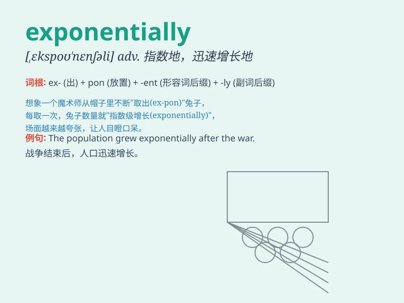

## exponentially

**英音:** _[ˌekspəˈnenʃəli]_ **美音:**
_[ˌekspəˈnenʃəli]_

**译义:** *adv. 以指数方式；呈几何级数地*

### 短语

+ **increase exponentially:** _呈指数增长_

+ **grow exponentially:** _指数式增长_

+ **decline exponentially:** _呈指数下降_

+ **rise exponentially:** _指数上升_

+ **drop exponentially:** _指数式下跌_

### 例句

#### 例句1

> **The population is growing exponentially.**

**中文翻译:** 人口正在呈指数增长。

**单词释义:** 以指数方式

#### 例句2

> **The value of the stock has increased exponentially over the past
year.**

**中文翻译:** 在过去的一年里，这只股票的价值呈指数增长。

**单词释义:** 呈指数级地

#### 例句3

> **The demand for this product is growing exponentially as its
popularity spreads.**

**中文翻译:** 随着其受欢迎程度的传播，对这种产品的需求呈指数增长。

**单词释义:** 以指数形式

### 背诵小故事

> A scientist was studying a population of rabbits. The number of
rabbits grew exponentially. It started with a few, then multiplied very
fast. This showed how things can increase in an exponential way.

**一位科学家正在研究一群兔子。兔子的数量呈指数增长。一开始数量很少，然后增长得非常快。这展示了事物如何以指数方式增加。**

### 图义

