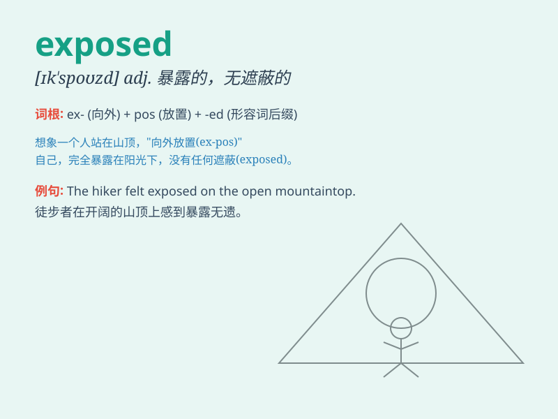

## exposed

**英音:** _[ɪk\'spəʊzd]_ **美音:** _[ɪk\'spozd]_

**译义:** *adj.暴露的,暴露于风雨中的,无掩蔽的*

### 短语

+ **exposed area:** _暴露区域_

+ **exposed wire:** _暴露的电线_

+ **be exposed to:** _暴露于；接触；面临_

+ **exposed position:** _暴露的位置_

+ **exposed skin:** _暴露的皮肤_

### 例句

#### 例句1

> **The exposed wires are dangerous.**

**中文翻译:** 裸露的电线很危险。

**单词释义:** 暴露的

#### 例句2

> **She was exposed to the virus.**

**中文翻译:** 她接触了病毒。

**单词释义:** 接触；暴露于

#### 例句3

> **The scandal exposed his true character.**

**中文翻译:** 这起丑闻暴露了他的真实性格。

**单词释义:** 揭露；使暴露

### 背诵小故事

> A brave explorer was climbing a mountain. When he reached the top, he
found himself exposed to strong winds and harsh sunlight. But he didn\'t
give up and still enjoyed the magnificent view.

**一位勇敢的探险家正在爬山。当他到达山顶时，他发现自己暴露在强风和烈日下。但他没有放弃，仍然欣赏着壮丽的景色。**

### 图义

