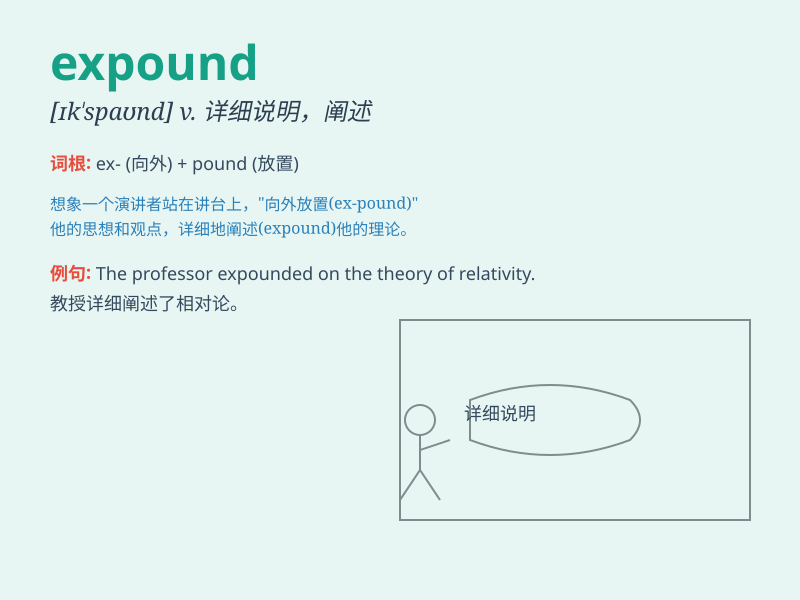

## expound

**英音:** _[ɪk\'spaʊnd; ek-]_ **美音:** _[ɪk\'spaʊnd]_

**译义:** *v.详细说明,解释*

### 短语

+ **expound on:** _详述；详细说明_

+ **expound sth clearly:** _清楚地阐述某事_

+ **expound a theory:** _阐述一个理论_

+ **expound an idea:** _解释一个想法_

+ **expound the meaning:** _解释意思_

### 例句

#### 例句1

> **The professor expounded on the theory of relativity in great
detail.**

**中文翻译:** 教授非常详细地阐述了相对论。

**单词释义:** 详细地解释，阐述

#### 例句2

> **She expounded her views on the subject to the committee.**

**中文翻译:** 她向委员会阐述了自己对这个问题的看法。

**单词释义:** 陈述，说明

#### 例句3

> **The minister expounded the government\'s policy on education.**

**中文翻译:** 部长阐述了政府的教育政策。

**单词释义:** 详细论述

### 背诵小故事

> A wise professor expounded complex theories to the students. He used
simple examples and clear explanations, making the difficult knowledge
easy to understand. The students were enlightened and gained a lot.

**一位睿智的教授向学生们阐述复杂的理论。他用简单的例子和清晰的解释，使难懂的知识变得容易理解。学生们受到启发，收获颇丰。**

### 图义

