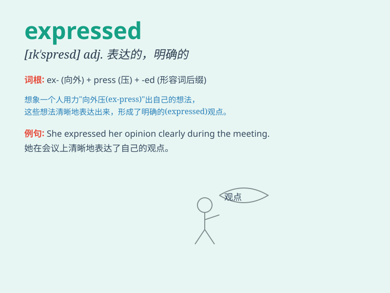

## expressed

**英音:** _[ɪkˈspresɪd]_ **美音:** _[ɪkˈspresɪd]_

**译义:** *v.
表达（express的过去式和过去分词）；快递（express的过去式和过去分词）；压出（汁、液等）（express的过去式和过去分词）*

### 短语

+ **expressed juice:** _榨出的果汁_

+ **expressed wish:** _明确表达的愿望_

+ **expressed consent:** _明确表示的同意_

+ **expressed opinion:** _表达的意见_

+ **expressed delivery:** _快递_

### 例句

#### 例句1

> **She expressed her gratitude to him for his help.**

**中文翻译:** 她向他表达了对他帮助的感激之情。

**单词释义:** 表达，表示

#### 例句2

> **His anger was expressed in his fierce words.**

**中文翻译:** 他的愤怒在他激烈的言辞中表现了出来。

**单词释义:** 表现，显露

#### 例句3

> **The artist expressed his creativity through his paintings.**

**中文翻译:** 这位艺术家通过他的画作展现了他的创造力。

**单词释义:** 展现，抒发

### 背诵小故事

> A little girl expressed her love for her mother by giving a big hug
and saying \'I love you\'. Her mother was so happy. Express means to
show or make known your feelings, thoughts or ideas.

**一个小女孩通过给妈妈一个大大的拥抱并说'我爱你'来表达她对妈妈的爱。她的妈妈非常开心。Express
意思是表示、表达你的感受、想法或观点。**

### 图义

