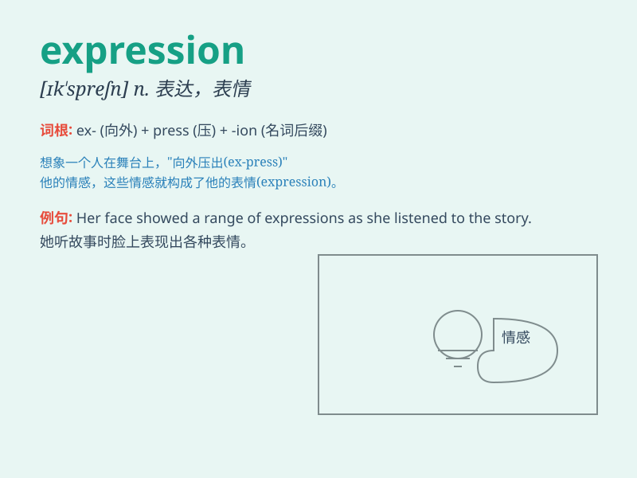

## expression

**英音:** _[ɪkˈspreʃn]_ **美音:** _[ɪkˈsprɛʃən]_

**译义:** *n.表达；表情；表现形式；词句*

### 短语

+ **facial expression:** _面部表情_

+ **emotional expression:** _情绪表达_

+ **free expression:** _自由表达_

+ **artistic expression:** _艺术表现_

+ **creative expression:** _创造性表达_

### 例句

#### 例句1

> **Her expression showed surprise when she saw the gift.**

**中文翻译:** 当她看到礼物时，她的表情显示出惊讶。

**单词释义:** 表情

#### 例句2

> **The artist\'s work is a powerful expression of his emotions.**

**中文翻译:** 这位艺术家的作品是他情感的有力表达。

**单词释义:** 表达

#### 例句3

> **Mathematical expressions can be quite complex.**

**中文翻译:** 数学表达式可能相当复杂。

**单词释义:** 表达式

### 背诵小故事

> One day, a little artist was drawing. His face showed a special
expression. It was a mix of happiness and concentration. Through his
expression, people knew how much he loved art.

**一天，一个小艺术家在画画。他的脸上呈现出一种特别的表情。那是快乐和专注的混合。通过他的表情，人们知道他有多热爱艺术。**

### 图义

