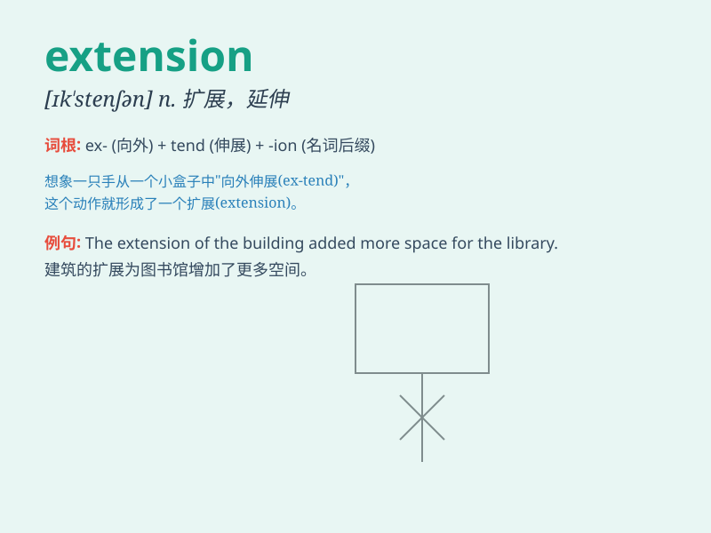

## extension

**英音:** _[ɪk\'stenʃ(ə)n; ek-]_ **美音:**
_[ɪk\'stɛnʃən]_

**译义:** *n.延长,扩充,范围n.扩展名adj.[逻]外延的,客观现实的*

### 短语

+ **extension cord:** _延长线；延长软线_

+ **extension number:** _分机号码_

+ **hair extension:** _接发；假发片_

+ **extension course:** _进修课程；推广课程_

+ **file extension:** _文件扩展名_

### 例句

#### 例句1

> **The extension of the deadline was a relief for many students.**

**中文翻译:** 截止日期的延长让许多学生松了一口气。

**单词释义:** 延长；延期

#### 例句2

> **I need to install an extension for my web browser to block
ads.**

**中文翻译:** 我需要为我的网络浏览器安装一个扩展程序来阻止广告。

**单词释义:** 扩展程序；插件

#### 例句3

> **The phone has an extension in the living room.**

**中文翻译:** 电话在客厅设有分机。

**单词释义:** 分机；支线

### 背诵小故事

> A man needed an extension for his project deadline. He pleaded with
his boss and finally got it. The extension gave him more time to perfect
his work.

**一个男人需要延长他项目的截止日期。他向老板恳求，最终得到了。这个延长给他更多时间来完善他的工作。**

### 图义

