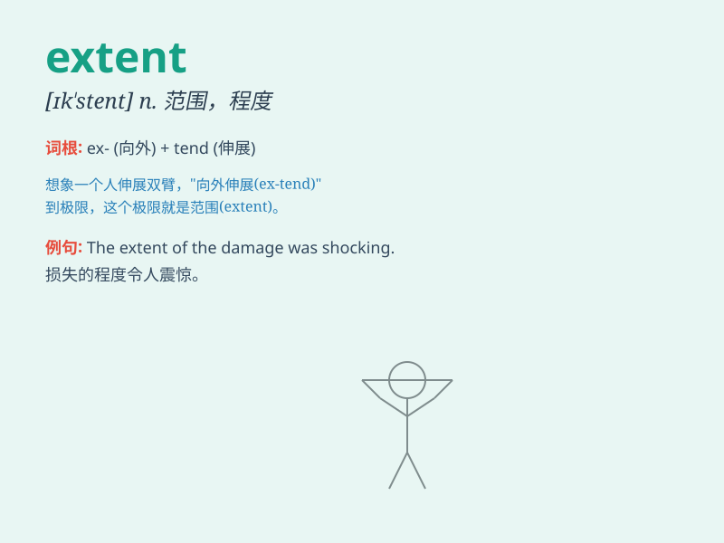

## extent

**英音:** _[ɪk\'stent; ek-]_ **美音:** _[ɪk\'stɛnt]_

**译义:**
*n.广度,宽度,长度,范围,程度,区域,[律]\<英>扣押,\<美>临时所有权令*

### 短语

+ **to a certain extent:** _在一定程度上_

+ **the full extent:** _全部范围_

+ **extent of damage:** _损害程度_

+ **extent of knowledge:** _知识范围_

+ **within extent:** _在范围内_

### 例句

#### 例句1

> **The extent of the damage was much greater than we expected.**

**中文翻译:** 损坏的程度比我们预期的要大得多。

**单词释义:** 程度；范围

#### 例句2

> **To a certain extent, I agree with you.**

**中文翻译:** 在某种程度上，我同意你的观点。

**单词释义:** 程度

#### 例句3

> **The extent of his knowledge is remarkable.**

**中文翻译:** 他的知识广博是惊人的。

**单词释义:** 程度；广度

### 背诵小故事

> A brave explorer set out to discover an unknown land. After days of
journey, he finally knew the extent of the territory - from the wide
river to the tall mountains. It was a vast and wonderful place.

**一位勇敢的探险家出发去探索一片未知的土地。经过几天的旅程，他终于了解了这片领土的范围------从宽阔的河流到高耸的山脉。这是一个广阔而美妙的地方。**

### 图义

