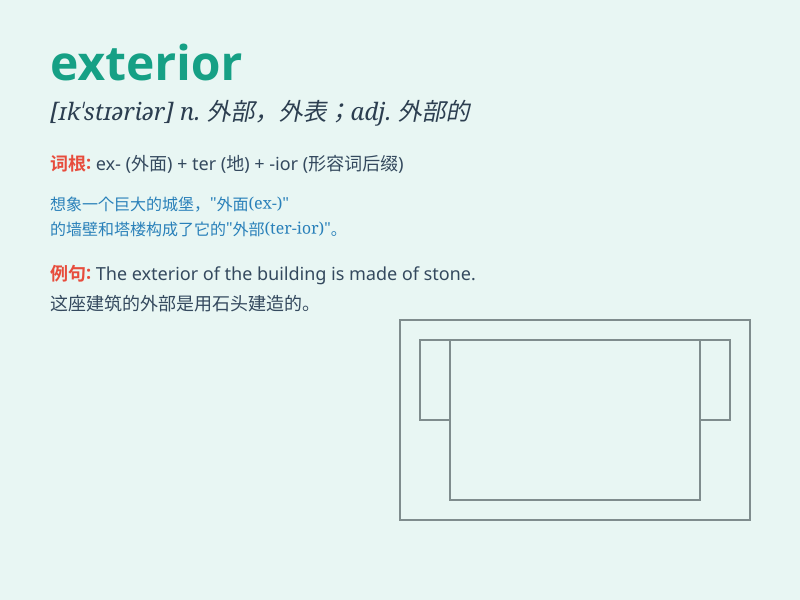

## exterior

**英音:** _[ɪk\'stɪərɪə; ek-]_ **美音:** _[ɪk\'stɪrɪɚ]_

**译义:**
*adj.外部的,外在的,表面的,外交的,[建](适合)外用的n.外部,表面,外型*

### 短语

+ **exterior wall:** _外墙_

+ **exterior angle:** _外角_

+ **exterior decoration:** _外部装饰_

+ **exterior surface:** _外表面_

+ **exterior lighting:** _外部照明_

### 例句

#### 例句1

> **The exterior of the building was beautifully designed.**

**中文翻译:** 建筑物的外部设计精美。

**单词释义:** 外观；外表

#### 例句2

> **She has a calm exterior but is actually very nervous inside.**

**中文翻译:** 她外表平静，但内心却非常紧张。

**单词释义:** 外表；外在

#### 例句3

> **The car\'s exterior was damaged in the accident.**

**中文翻译:** 该车的外部在事故中受损。

**单词释义:** 外部；外面

### 背诵小故事

> A brave explorer was lost in a jungle. When he finally found a way
out, he saw the exterior of a beautiful castle. It was a wonderful sight
that he would never forget. The exterior means the outer surface or
appearance.

**一位勇敢的探险家在丛林中迷路了。当他最终找到出路时，他看到了一座美丽城堡的外观。那是他永远不会忘记的美妙景象。exterior
意思是外部的表面或外观。**

### 图义

