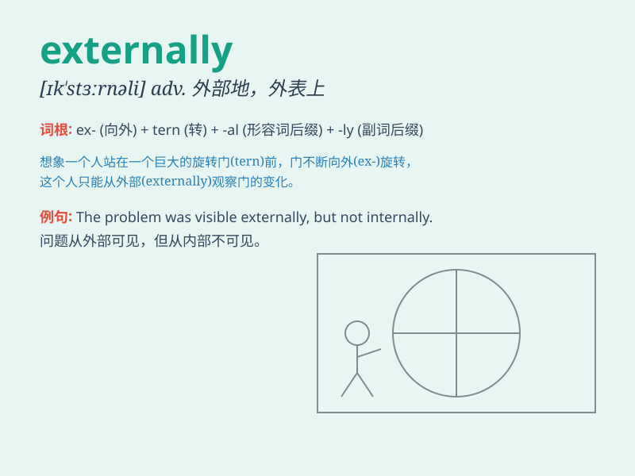

## externally

**英音:** _[ɛksˈtɜːnli]_ **美音:** _[ɪkˈstɜrnəli]_

**译义:** *adv.外表上,外形上*

### 短语

+ **externally imposed:** _外部强加的_

+ **externally driven:** _外部驱动的_

+ **externally visible:** _外部可见的_

+ **externally sourced:** _外部来源的_

+ **externally controlled:** _外部控制的_

### 例句

#### 例句1

> **The building looks impressive externally, but the interior needs
renovation.**

**中文翻译:** 这座建筑从外面看起来令人印象深刻，但内部需要翻新。

**单词释义:** 在外面；外表上

#### 例句2

> **The machine is externally very simple, but its internal structure
is complex.**

**中文翻译:** 这台机器外表看起来非常简单，但内部结构很复杂。

**单词释义:** 从外部；在外部

#### 例句3

> **Externally, she appeared calm and composed, but inside she was
very nervous.**

**中文翻译:** 从表面上看，她显得平静和镇定，但内心却非常紧张。

**单词释义:** 表面上；外观上

### 背诵小故事

> A little bird was injured externally. But with the help of kind
people, it recovered. \'Externally\' means related to the outside or
surface. Just like the bird\'s visible injury.

**一只小鸟外部受伤了。但在好心人的帮助下，它康复了。\'externally\'意思是与外部或表面有关。就像小鸟能看到的伤。**

### 图义

