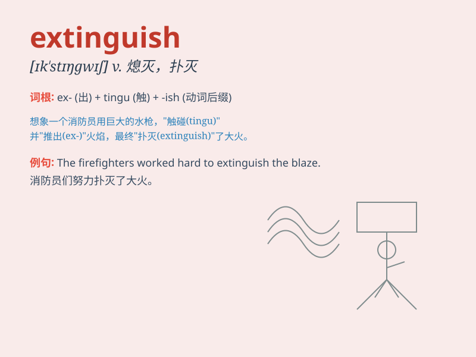

## extinguish

**英音:** _[ɪkˈstɪŋgwɪʃ]_ **美音:** _[ɪk\'stɪŋɡwɪʃ]_

**译义:** *vt.熄灭,消灭,压制,使黯然失色,偿清*

### 短语

+ **extinguish fire:** _灭火_

+ **extinguish hope:** _破灭希望_

+ **extinguish light:** _熄灭灯光_

+ **extinguish a debt:** _清偿债务_

+ **extinguish enthusiasm:** _打消热情_

### 例句

#### 例句1

> **The firemen managed to extinguish the fire.**

**中文翻译:** 消防员设法扑灭了大火。

**单词释义:** 扑灭，熄灭

#### 例句2

> **He extinguished his cigarette before entering the building.**

**中文翻译:** 他在进入大楼前熄灭了香烟。

**单词释义:** 熄灭

#### 例句3

> **Her hope was extinguished by the bad news.**

**中文翻译:** 这个坏消息使她的希望破灭了。

**单词释义:** 使破灭，消除

### 背诵小故事

> A huge fire was burning in the forest. Firefighters worked hard to
extinguish it. They used water and special tools to put out the flames
and make the area safe again.

**森林里燃起了一场大火。消防员们努力工作来扑灭它。他们用水和特殊工具扑灭火焰，让这个区域再次安全。**

### 图义

