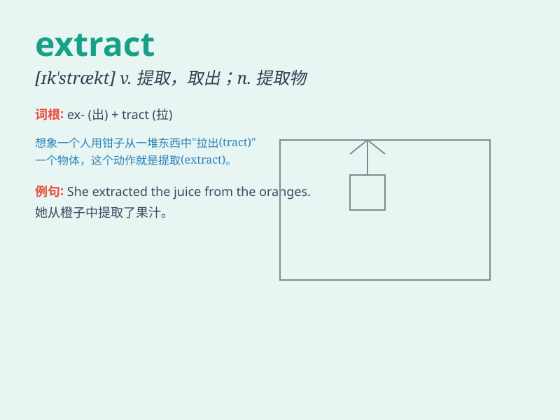

## extract

**英音:** _[ˈekstrækt; ɪkˈstrækt]_ **美音:** _[ˈɛksˌtrækt;
ɪkˈstrækt]_

**译义:**
*n.精,汁,榨出物,摘录,选粹vt.拔出,榨取,开方,求根,摘录,析取,吸取*

### 短语

+ **extract from:** _从\...\...中提取；从\...\...摘录_

+ **extract information:** _提取信息_

+ **plant extract:** _植物提取物_

+ **extract essence:** _提取精华_

+ **data extract:** _数据提取_

### 例句

#### 例句1

> **The dentist will extract the tooth.**

**中文翻译:** 牙医将要拔掉这颗牙齿。

**单词释义:** 拔出，抽出

#### 例句2

> **She managed to extract the key information from the long
report.**

**中文翻译:** 她设法从冗长的报告中提取出关键信息。

**单词释义:** 提取，选取

#### 例句3

> **The machine can extract juice from fruits.**

**中文翻译:** 这台机器能从水果中榨出果汁。

**单词释义:** 榨取，榨出

### 背诵小故事

> A brave miner was in a deep cave. He used special tools to extract
precious gems. The gems were hidden and hard to get, but his efforts
paid off. He successfully extracted them.

**一位勇敢的矿工在一个很深的洞穴里。他使用特殊工具来提取珍贵的宝石。宝石被藏起来且很难获取，但他的努力得到了回报。他成功地提取了它们。**

### 图义

