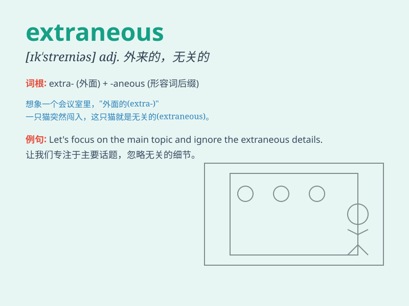

## extraneous

**英音:** _[ɪk\'streɪnɪəs; ek-]_ **美音:**
_[ɪk\'strenɪəs]_

**译义:** *adj.无关系的,外来的,[化]外部裂化,[化]新异反射*

### 短语

+ **extraneous information:** _无关信息；多余的信息_

+ **extraneous factors:** _外部因素；无关因素_

+ **extraneous noise:** _外来噪音；无关噪声_

+ **extraneous expenses:** _额外费用；不必要的开支_

+ **extraneous circumstances:** _外在情况；无关的情形_

### 例句

#### 例句1

> **The report contained extraneous information that was not relevant
to the main topic.**

**中文翻译:** 这份报告包含了与主题无关的多余信息。

**单词释义:** 无关的；多余的

#### 例句2

> **She tried to ignore the extraneous noises and focus on her
work.**

**中文翻译:** 她试图忽略那些外来的噪音，专注于她的工作。

**单词释义:** 外来的；外部的

#### 例句3

> **The new law aims to eliminate extraneous bureaucratic
procedures.**

**中文翻译:** 新法律旨在消除多余的官僚程序。

**单词释义:** 多余的；不必要的

### 背诵小故事

> A detective was solving a case. There were many clues, but some were
extraneous. They led him in the wrong direction. Finally, he focused on
the relevant ones and caught the criminal.

**一位侦探在破案。有很多线索，但有些是无关紧要的。它们把他引向了错误的方向。最后，他专注于相关的线索并抓住了罪犯。**

### 图义

