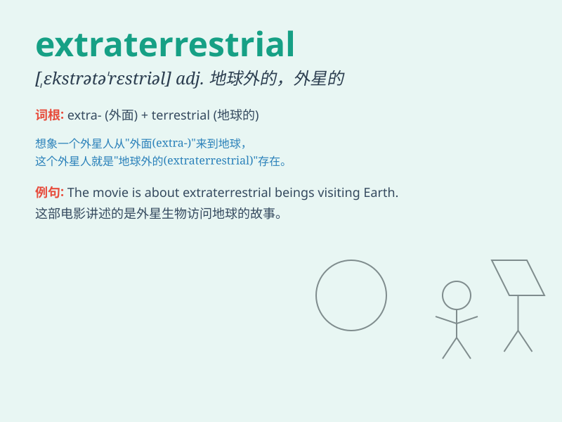

## extraterrestrial

**英音:** _[,ekstrətə\'restrɪəl]_ **美音:**
_[\'ɛkstrətə\'rɛstrɪəl]_

**译义:** *adj.地球外的,宇宙的*

### 短语

+ **extraterrestrial being:** _外星生物_

+ **extraterrestrial intelligence:** _外星智慧_

+ **extraterrestrial life:** _外星生命_

+ **extraterrestrial object:** _外星物体_

+ **extraterrestrial origin:** _外星起源_

### 例句

#### 例句1

> **Scientists are constantly searching for signs of extraterrestrial
life.**

**中文翻译:** 科学家们一直在寻找外星生命的迹象。

**单词释义:** 外星的；地球外的

#### 例句2

> **The movie is about an encounter with extraterrestrial beings.**

**中文翻译:** 这部电影是关于与外星生物的一次相遇。

**单词释义:** 外星的；地球外的

#### 例句3

> **Some people believe in the existence of extraterrestrial
civilizations.**

**中文翻译:** 一些人相信外星文明的存在。

**单词释义:** 外星的；地球外的

### 背诵小故事

> One day, a boy was looking at the starry sky and wondered if there
were extraterrestrial beings out there. Suddenly, a strange light
appeared, making him think of creatures from beyond Earth. Maybe they
were friendly and wanted to visit us!

**有一天，一个男孩望着星空，好奇是否存在外星生物。突然，一道奇异的光出现，让他想到了来自地球之外的生物。也许他们很友好，想来拜访我们！**

### 图义

