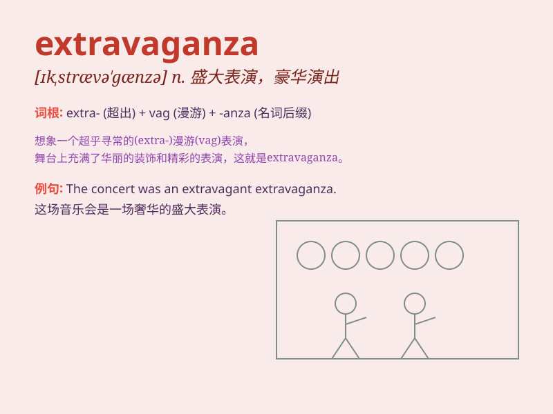

## extravaganza

**英音:** _[ɪk,strævə\'gænzə; ek-]_ **美音:**
_[ɪk,strævə\'ɡænzə]_

**译义:** *n.内容狂妄的作品,狂妄的言行*

### 短语

+ **extravaganza show:** _豪华演出_

+ **musical extravaganza:** _音乐盛宴_

+ **fashion extravaganza:** _时尚盛典_

+ **fireworks extravaganza:** _烟花汇演_

+ **spectacular extravaganza:** _壮观的盛会_

### 例句

#### 例句1

> **The wedding was an extravagant extravaganza that cost a
fortune.**

**中文翻译:** 这场婚礼是一场奢华的盛事，花费了一大笔钱。

**单词释义:** 奢华的大型活动；铺张华丽的表演

#### 例句2

> **The music festival was a three-day extravaganza of live
performances and DJ sets.**

**中文翻译:** 这个音乐节是为期三天的现场表演和 DJ 秀的盛大活动。

**单词释义:** 盛大的活动；豪华的演出

#### 例句3

> **The fashion show was an extravaganza of creativity and style.**

**中文翻译:** 这场时装秀是创意和风格的华丽展示。

**单词释义:** 精彩的展示；盛大华丽的场面

### 背诵小故事

> A rich man decided to throw an extravaganza party. He spent a lot of
money on decorations, food, and entertainment. Everyone was amazed by
the grand and excessive celebration. Remember, extravaganza means a
lavish and spectacular event.

**一个富人决定举办一场盛大奢华的派对。他在装饰、食物和娱乐上花了很多钱。每个人都对这场盛大且铺张的庆祝活动感到惊讶。记住，extravaganza
意思是盛大铺张的表演或活动。**

### 图义

