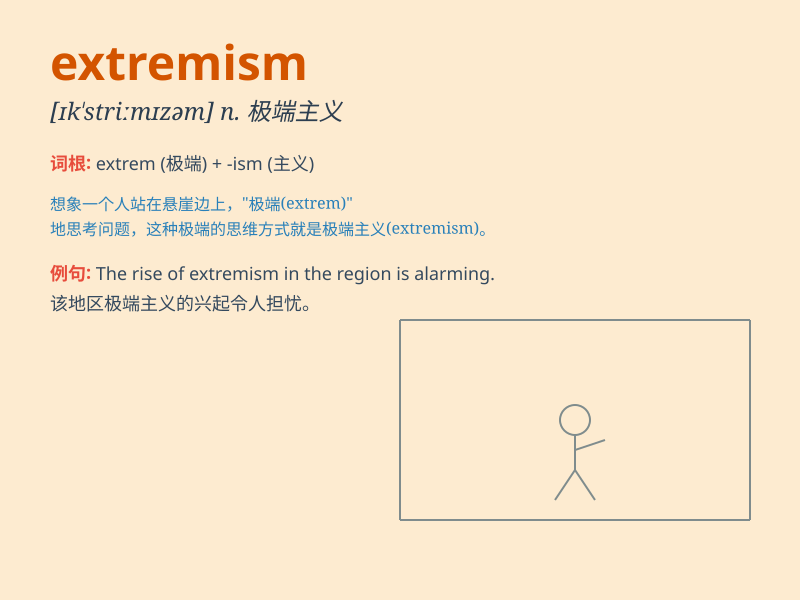

## extremism

**英音:** _[ɪk\'striːmɪz(ə)m; ek-]_ **美音:**
_[ɪk\'strimɪzəm]_

**译义:** *n.极端的倾向,过激主义,极端论*

### 短语

+ **religious extremism:** _宗教极端主义_

+ **political extremism:** _政治极端主义_

+ **extremism ideology:** _极端主义意识形态_

+ **combat extremism:** _打击极端主义_

+ **extremism threat:** _极端主义威胁_

### 例句

#### 例句1

> **The government is committed to combating extremism of all
kinds.**

**中文翻译:** 政府致力于打击各种极端主义。

**单词释义:** 极端主义

#### 例句2

> **Extremism often leads to social instability and violence.**

**中文翻译:** 极端主义常常导致社会不稳定和暴力。

**单词释义:** 极端主义

#### 例句3

> **We must raise public awareness of the dangers of extremism.**

**中文翻译:** 我们必须提高公众对极端主义危险的认识。

**单词释义:** 极端主义

### 背诵小故事

> A group of people always held extreme views and took radical actions.
They were called extremism. Their behavior caused a lot of trouble and
made others feel scared. We should avoid such extremism and seek
balance.

**一群人总是持有极端的观点并采取激进的行动。他们被称为极端主义。他们的行为造成了很多麻烦，让其他人感到害怕。我们应该避免这种极端主义，寻求平衡。**

### 图义

