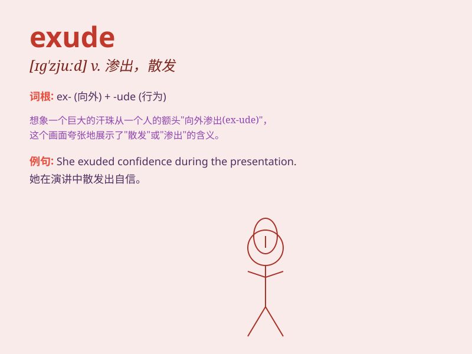

## exude

**英音:** _[ɪg\'zjuːd; eg-]_ **美音:** _[ɪɡ\'zud]_

**译义:** *v.(使)流出,(使)渗出,发散开来*

### 短语

+ **exude confidence:** _流露出自信_

+ **exude charm:** _散发魅力_

+ **exude enthusiasm:** _洋溢着热情_

+ **exude sweat:** _出汗；冒汗_

+ **exude a pleasant smell:** _散发出宜人的气味_

### 例句

#### 例句1

> **The flowers exude a sweet fragrance.**

**中文翻译:** 这些花散发出甜美的香气。

**单词释义:** 散发

#### 例句2

> **He exuded confidence during the interview.**

**中文翻译:** 他在面试中流露出自信。

**单词释义:** 流露

#### 例句3

> **The tree stump was still exuding sap.**

**中文翻译:** 这棵树桩仍在渗出汁液。

**单词释义:** 渗出

### 背诵小故事

> A bee was gathering nectar. As it flew back to the hive, it exuded a
sweet smell. The smell spread around, making the garden fragrant. Just
like the bee, things that exude often give off something noticeable.

**一只蜜蜂正在采集花蜜。当它飞回蜂巢时，散发出一股甜美的气味。这气味四处传播，让花园充满芳香。就像这只蜜蜂一样，exude
表示散发、流出通常是指散发出明显的东西。**

### 图义

