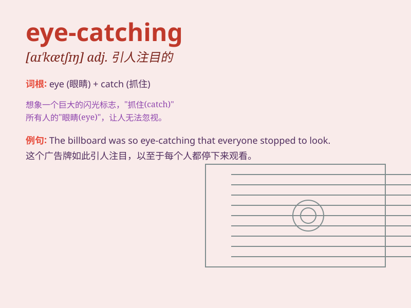

## eye-catching

**英音:** _null_ **美音:** _null_

**译义:** *null*

### 短语

+ **eye-catching design:** _引人注目的设计_

+ **eye-catching color:** _醒目的颜色_

+ **eye-catching advertisement:** _引人注目的广告_

+ **eye-catching display:** _引人注目的展示_

+ **eye-catching outfit:** _引人注目的服装_

### 例句

#### 例句1

> **The eye-catching dress caught everyone\'s attention at the
party.**

**中文翻译:** 那件引人注目的连衣裙在聚会上吸引了所有人的注意。

**单词释义:** 引人注目的

#### 例句2

> **The advertisement with its eye-catching colors was very
effective.**

**中文翻译:** 那个有着醒目色彩的广告非常有效。

**单词释义:** 醒目的

#### 例句3

> **The new car has an eye-catching design.**

**中文翻译:** 这辆新车有一个引人注目的设计。

**单词释义:** 引人注目的

### 背诵小故事

> A poor artist was painting in the street. Everyone ignored him. But
when he showed a very eye-catching painting of a beautiful bird, people
stopped and gathered around. The painting was so attractive that it
caught everyone\'s eyes.

**一位贫穷的艺术家正在街头作画。大家都不理睬他。但当他展示出一幅非常引人注目的美丽鸟儿的画作时，人们都停了下来并围了过去。这幅画太有吸引力了，吸引了所有人的目光。**

### 图义

