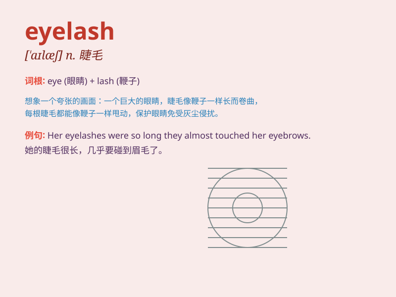

## eyelash

**英音:** _[\'aɪlæʃ]_ **美音:** _[\'aɪ\'læʃ]_

**译义:** *n.睫毛*

### 短语

+ **long eyelashes:** _长长的睫毛_

+ **curly eyelashes:** _卷曲的睫毛_

+ **false eyelashes:** _假睫毛_

+ **eyelash curler:** _睫毛夹_

+ **eyelash extension:** _睫毛嫁接_

### 例句

#### 例句1

> **She has long and beautiful eyelashes.**

**中文翻译:** 她有又长又美的睫毛。

**单词释义:** 睫毛（复数形式）

#### 例句2

> **One of her eyelashes fell onto her cheek.**

**中文翻译:** 她的一根睫毛掉到了脸颊上。

**单词释义:** 睫毛（单数形式）

#### 例句3

> **The mascara made her eyelashes look thicker.**

**中文翻译:** 睫毛膏让她的睫毛看起来更浓密了。

**单词释义:** 睫毛（复数形式）

### 背诵小故事

> A fairy had very beautiful eyelashes. One day, she lost an eyelash
while flying. She searched everywhere and finally found it under a magic
tree. The eyelash shone with magic light.

**一个仙女有着非常美丽的睫毛。有一天，她在飞行时掉了一根睫毛。她到处寻找，最后在一棵魔法树下找到了它。这根睫毛闪耀着神奇的光芒。**

### 图义

