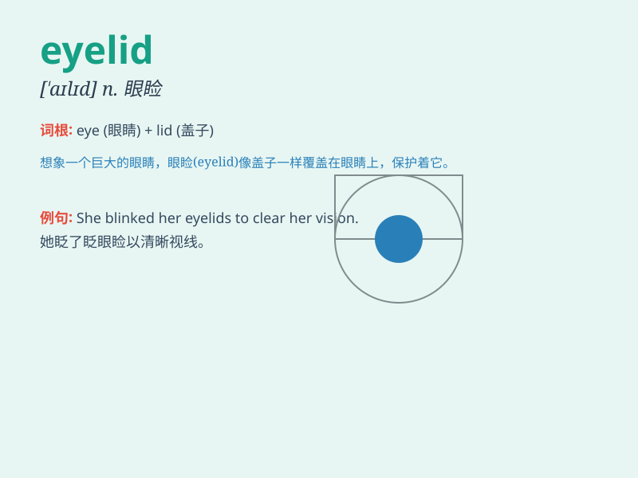

## eyelid

**英音:** _[\'aɪlɪd]_ **美音:** _[\'aɪ,lɪd]_

**译义:** *n.眼皮,眼睑*

### 短语

+ **upper eyelid:** _上眼睑_

+ **lower eyelid:** _下眼睑_

+ **eyelid twitching:** _眼睑抽搐_

+ **eyelid swelling:** _眼睑肿胀_

+ **eyelid margin:** _眼睑边缘_

### 例句

#### 例句1

> **She batted her eyelid s seductively.**

**中文翻译:** 她迷人地眨了眨眼睛。

**单词释义:** 眼皮

#### 例句2

> **The eyelid was swollen and painful.**

**中文翻译:** 眼皮肿了而且很痛。

**单词释义:** 眼皮

#### 例句3

> **He had a small mole on his eyelid.**

**中文翻译:** 他的眼皮上有一颗小痣。

**单词释义:** 眼皮

### 背诵小故事

> One day, a little bug landed on my eyelid. It tickled and made my eye
blink rapidly. I had to be careful to remove the bug gently. Remember,
eyelid is the part that protects our eyes!

**有一天，一只小虫子落在了我的眼皮上。它弄得痒痒的，让我的眼睛快速眨动。我得小心地轻轻把虫子弄掉。记住，eyelid
就是保护我们眼睛的那个部分！**

### 图义

