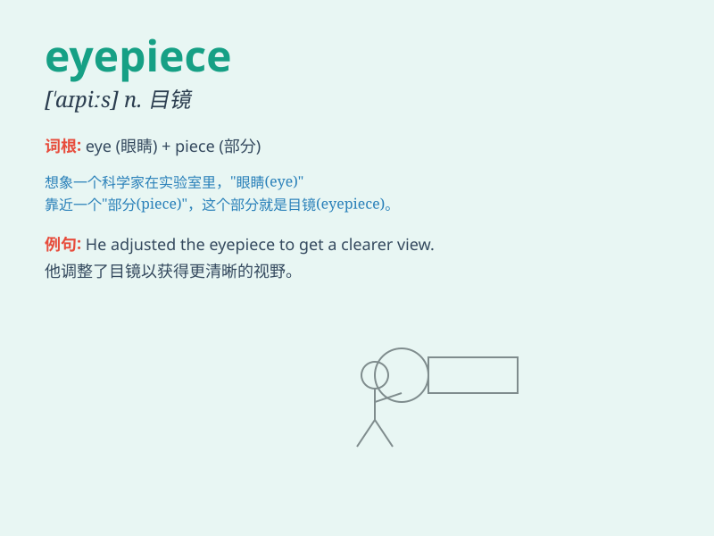

## eyepiece

**英音:** _[\'aɪpiːs]_ **美音:** _[\'aɪ\'pis]_

**译义:** *n.目镜*

### 短语

+ **binocular eyepiece:** _双筒目镜_

+ **telescope eyepiece:** _望远镜目镜_

+ **microscope eyepiece:** _显微镜目镜_

+ **wide-angle eyepiece:** _广角目镜_

+ **zoom eyepiece:** _变焦目镜_

### 例句

#### 例句1

> **The eyepiece of the telescope was dirty.**

**中文翻译:** 望远镜的目镜脏了。

**单词释义:** 目镜

#### 例句2

> **He adjusted the eyepiece to get a clearer view.**

**中文翻译:** 他调整目镜以获得更清晰的视野。

**单词释义:** 目镜

#### 例句3

> **The new eyepiece improved the magnification significantly.**

**中文翻译:** 新的目镜显著提高了放大倍数。

**单词释义:** 目镜

### 背诵小故事

> One day, a little scientist was looking through a telescope. The part
he put close to his eye to see clearly was called the eyepiece. It was
like a magic window that helped him explore the stars.

**有一天，一位小科学家正在通过望远镜观察。他靠近眼睛用来清晰观看的那个部分被称为目镜。它就像一个神奇的窗口，帮助他探索星星。**

### 图义

