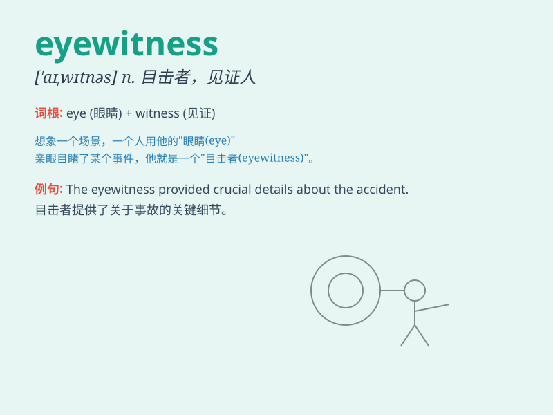

## eyewitness

**英音:** _[\'aɪwɪtnɪs]_ **美音:** _[\'aɪwɪtnəs]_

**译义:** *n.目击者,见证人*

### 短语

+ **eyewitness account:** _目击者的陈述_

+ **eyewitness testimony:** _目击者证词_

+ **eyewitness evidence:** _目击者证据_

+ **eyewitness report:** _目击者报告_

+ **credible eyewitness:** _可靠的目击者_

### 例句

#### 例句1

> **The eyewitness provided a detailed description of the crime
scene.**

**中文翻译:** 目击者详细描述了犯罪现场。

**单词释义:** 目击者

#### 例句2

> **We need an eyewitness to confirm what happened.**

**中文翻译:** 我们需要目击者来证实发生了什么。

**单词释义:** 目击者

#### 例句3

> **The police interviewed several eyewitnesses to the accident.**

**中文翻译:** 警方采访了几名事故目击者。

**单词释义:** 目击者

### 背诵小故事

> One day, a robbery happened in a busy street. Luckily, Tom was there
and saw everything clearly. He became the eyewitness and was able to
describe the criminals precisely to the police.

**有一天，一条繁忙的街道上发生了一起抢劫案。幸运的是，汤姆当时在那里，看得一清二楚。他成了目击证人，并能够向警方准确地描述罪犯。**

### 图义

