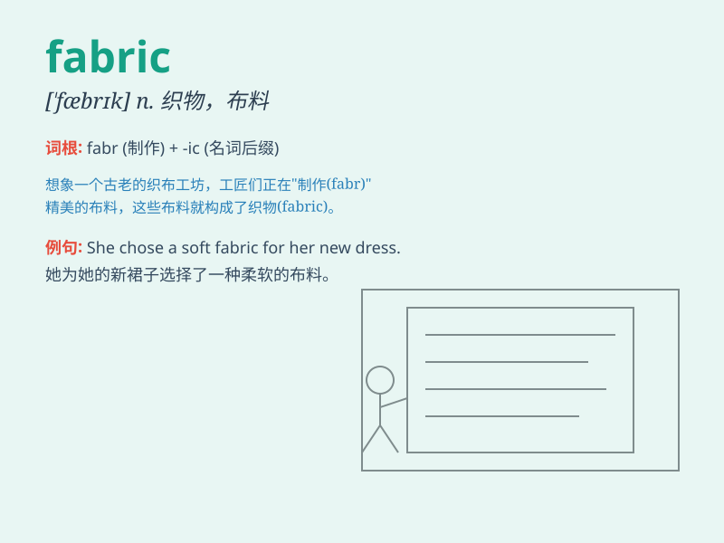

## fabric

**英音:** _[\'fæbrɪk]_ **美音:** _[\'fæbrɪk]_

**译义:** *n.织品,织物,布,结构,建筑物,构造*

### 短语

+ **cotton fabric:** _棉织物_

+ **textile fabric:** _纺织织物_

+ **woolen fabric:** _毛织物_

+ **silk fabric:** _丝绸织物_

+ **synthetic fabric:** _合成织物_

### 例句

#### 例句1

> **The fabric of this dress is very soft and smooth.**

**中文翻译:** 这件衣服的面料非常柔软光滑。

**单词释义:** 布料；织物

#### 例句2

> **The social fabric of the country has been severely damaged by the
war.**

**中文翻译:** 该国的社会结构因战争而遭到严重破坏。

**单词释义:** 结构；构造

#### 例句3

> **The fabric of his argument was weak and unconvincing.**

**中文翻译:** 他的论点结构薄弱且缺乏说服力。

**单词释义:** 基础；架构

### 背诵小故事

> A tailor was working hard with different fabrics. One day, a special
fabric with a beautiful pattern caught his eye. It was so fine and
smooth. From then on, he always remembered this amazing fabric.

**一位裁缝正在努力处理各种织物。有一天，一块有着漂亮图案的特殊织物吸引了他的目光。它如此精美光滑。从那以后，他总是记得这块令人惊叹的织物。**

### 图义

