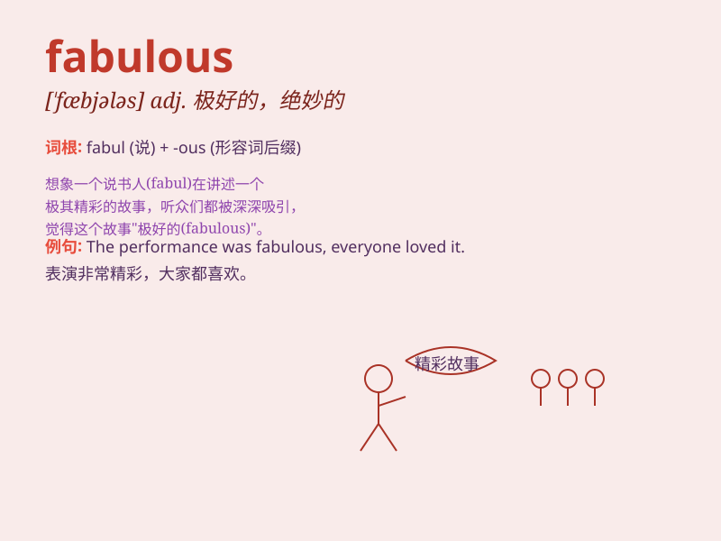

## fabulous

**英音:** _[\'fæbjʊləs]_ **美音:** _[\'fæbjələs]_

**译义:**
*adj.寓言中的,寓言般的,神话般的,传统上的,惊人的,难以置信的*

### 短语

+ **fabulous wealth:** _巨额财富_

+ **fabulous story:** _精彩的故事_

+ **fabulous success:** _巨大的成功_

+ **fabulous creature:** _神话中的生物_

+ **fabulous achievement:** _非凡的成就_

### 例句

#### 例句1

> **The view from the top of the mountain was fabulous.**

**中文翻译:** 从山顶看去的景色真是美极了。

**单词释义:** 极好的；绝妙的

#### 例句2

> **She wore a fabulous diamond necklace to the party.**

**中文翻译:** 她戴着一条精美的钻石项链参加聚会。

**单词释义:** 极好的；绝妙的；惊人的

#### 例句3

> **The story he told was simply fabulous.**

**中文翻译:** 他讲的故事简直太精彩了。

**单词释义:** 精彩的；令人难以置信的

### 背诵小故事

> A fairy had a fabulous magic wand. With it, she could create
wonderful things. One day, she used it to make a beautiful garden full
of colorful flowers. The scene was just fabulous.

**一位仙女有一根神奇的魔杖。凭借它，她能创造出奇妙的东西。有一天，她用它打造了一座满是五颜六色花朵的美丽花园。这景象简直太美妙了。**

### 图义

