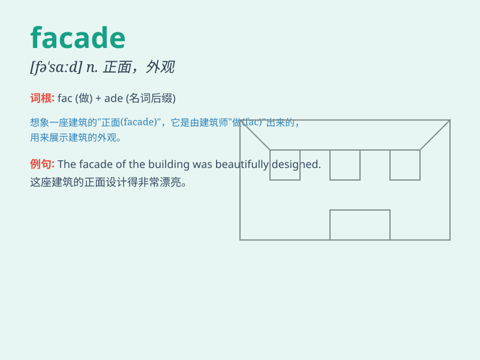

## facade

**英音:** _[fə\'sɑːd]_ **美音:** _[fə\'sɑd]_

**译义:** *n.正面*

### 短语

+ **put up a facade:** _装门面；装样子_

+ **behind the facade:** _在表面背后；在伪装之下_

+ **false facade:** _虚假的外表；假门面_

+ **crumbling facade:** _摇摇欲坠的外表；即将崩溃的伪装_

+ **maintain the facade:** _维持表面形象；保持伪装_

### 例句

#### 例句1

> **The facade of the building was beautifully decorated with
lights.**

**中文翻译:** 建筑物的正面被灯光装饰得非常漂亮。

**单词释义:** （建筑物的）正面；外观

#### 例句2

> **He put on a facade of confidence, but inside he was very
nervous.**

**中文翻译:** 他表面上表现得很自信，但内心却非常紧张。

**单词释义:** 表面；伪装

#### 例句3

> **The old hotel had a charming facade that attracted many
tourists.**

**中文翻译:** 这家古老的酒店有着迷人的外观，吸引了许多游客。

**单词释义:** （建筑物的）正面；外表

### 背诵小故事

>
想象一个古老的城堡，城堡的正面（facade）非常华丽壮观，吸引了众多游客。但其实内部有些破败。这个华丽的正面就像facade，只是表面的样子，不一定代表真实的全部。

**想象一座古老城堡的正面很华丽壮观，但内部破败，借此理解facade意为表面、外观**

### 图义

