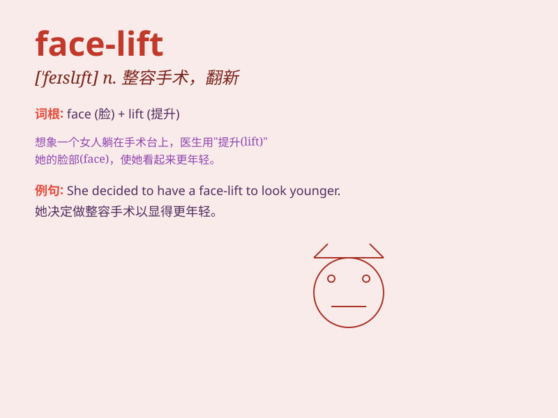

## face-lift

**英音:** _[feɪs laɪft]_ **美音:** _[feɪs laɪft]_

**译义:** *n. 整容手术；翻新，翻修*

### 短语

+ **give a face-lift:** _进行整容；进行翻新_

+ **need a face-lift:** _需要整容；需要翻新_

+ **undergo a face-lift:** _接受整容；经历翻新_

+ **major face-lift:** _重大整容；大规模翻新_

+ **minor face-lift:** _小幅度整容；小规模翻新_

### 例句

#### 例句1

> **The old hotel is undergoing a major face-lift to attract more
guests.**

**中文翻译:** 这家老旧的酒店正在进行大规模的翻新以吸引更多客人。

**单词释义:** 翻新，整修

#### 例句2

> **She decided to get a face-lift to improve her appearance.**

**中文翻译:** 她决定做整容手术来改善自己的外貌。

**单词释义:** 整容手术

#### 例句3

> **The city center has received a face-lift with new buildings and
improved infrastructure.**

**中文翻译:** 市中心经过新建筑和基础设施的改善迎来了新面貌。

**单词释义:** 面貌改观，改造

### 背诵小故事

>
想象一个老旧的房子，它的外观破旧不堪。有一天，工人们来了，给它重新粉刷墙面，更换门窗，这就像是给房子来了一次
face-lift，让它焕然一新。所以 face-lift 就是'翻新；改造；整容'的意思。

**想象一个老旧房子的翻新过程来理解 face-lift
这个词，表示翻新、改造、整容**

### 图义

