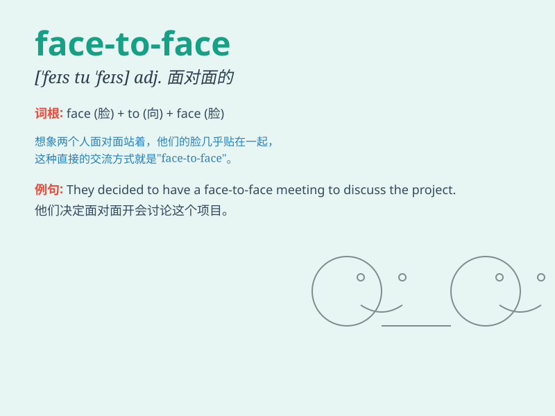

## face-to-face

**英音:** _[ˈfeɪs.tuː ˈfeɪs]_ **美音:** _[ˈfeɪs.tu
ˈfeɪs]_

**译义:** *面对面的，直接的；个人之间的，不借助中介的*

### 短语

+ **face-to-face meeting:** _面对面的会议_

+ **face-to-face communication:** _面对面交流_

+ **face-to-face interview:** _面对面的面试_

+ **face-to-face conversation:** _面对面的谈话_

+ **face-to-face encounter:** _面对面的相遇_

### 例句

#### 例句1

> **We had a face-to-face meeting to discuss the project.**

**中文翻译:** 我们进行了一次面对面的会议来讨论这个项目。

**单词释义:** 面对面的

#### 例句2

> **A face-to-face conversation is often more effective than an
email.**

**中文翻译:** 面对面的交谈通常比电子邮件更有效。

**单词释义:** 面对面的

#### 例句3

> **The teacher had a face-to-face talk with the student about his
behavior.**

**中文翻译:** 老师和学生就他的行为进行了一次面对面的谈话。

**单词释义:** 面对面的

### 背诵小故事

> One day, Tom had a very important meeting. He needed to have a
face-to-face talk with his boss to solve some problems. They sat
opposite each other and discussed sincerely.

**一天，汤姆有一个非常重要的会议。他需要和他的老板进行面对面的交谈来解决一些问题。他们面对面坐着，真诚地讨论。**

### 图义

