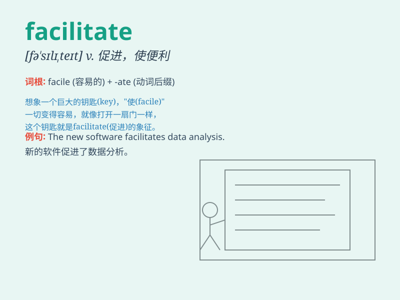

## facilitate

**英音:** _[fə\'sɪlɪteɪt]_ **美音:** _[fə\'sɪlə\'tet]_

**译义:** *vt.(不以人作主语的)使容易,使便利,推动,帮助,使容易,促进*

### 短语

+ **facilitate communication:** _促进交流_

+ **facilitate learning:** _促进学习_

+ **facilitate progress:** _促进进展_

+ **facilitate trade:** _促进贸易_

+ **facilitate movement:** _使移动更便利_

### 例句

#### 例句1

> **The new software will facilitate communication between teams.**

**中文翻译:** 新软件将促进团队之间的沟通。

**单词释义:** 促进；帮助；使便利

#### 例句2

> **Good planning can facilitate the project\'s success.**

**中文翻译:** 良好的规划可以促进项目的成功。

**单词释义:** 促进；有助于

#### 例句3

> **This tool facilitates the process of data analysis.**

**中文翻译:** 该工具有助于数据分析过程。

**单词释义:** 使便利；使容易

### 背诵小故事

> Once upon a time, a kind fairy had the power to facilitate people\'s
dreams. She made difficult wishes come true easily, just like the
meaning of \'facilitate\' - to make something easier or help it happen
smoothly.

**从前，有一个善良的仙女拥有促成人们梦想的力量。她能让困难的愿望轻易实现，就像'facilitate'这个词的意思------使某事变得更容易或帮助其顺利发生。**

### 图义

