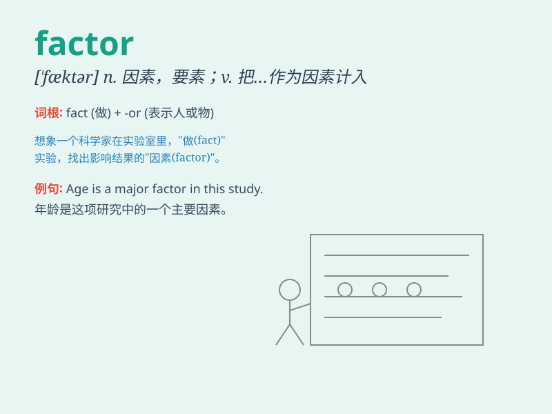

## factor

**英音:** _[\'fæktə]_ **美音:** _[\'fæktɚ]_

**译义:** *n.因素,要素,因数,代理人*

### 短语

+ **factor in:** _把...计算在内；把...包括在内_

+ **risk factor:** _风险因素_

+ **key factor:** _关键因素_

+ **decisive factor:** _决定性因素_

+ **dominant factor:** _主导因素_

### 例句

#### 例句1

> **The weather was a factor in our decision to postpone the
picnic.**

**中文翻译:** 天气是我们决定推迟野餐的一个因素。

**单词释义:** 因素；要素

#### 例句2

> **Genetic factors can influence a person\'s susceptibility to
certain diseases.**

**中文翻译:** 遗传因素会影响一个人对某些疾病的易感性。

**单词释义:** 因素；要素

#### 例句3

> **We need to factor in the cost of materials when calculating the
budget.**

**中文翻译:** 我们在计算预算时需要考虑材料成本。

**单词释义:** 把...因素包括进去；将...计入

### 背诵小故事

> A factory owner was facing problems. He realized that many factors,
like low worker morale and poor machine maintenance, were affecting
production. He needed to address these factors to improve the situation.

**一位工厂老板正面临问题。他意识到很多因素，如工人士气低落和机器维护不善，都在影响生产。他需要解决这些因素来改善状况。**

### 图义

