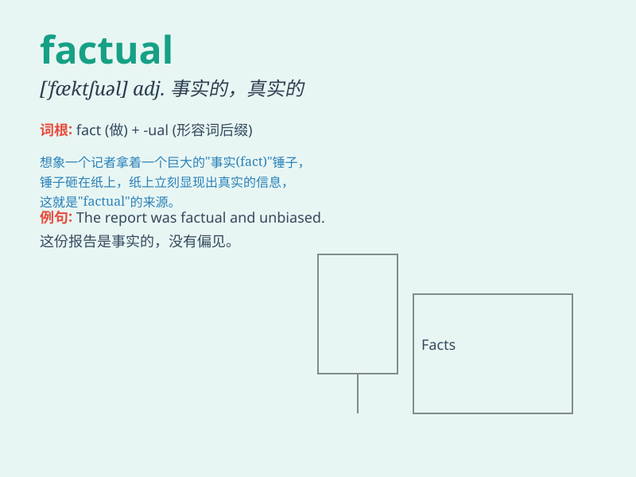

## factual

**英音:** _[\'fæktʃʊəl; -tjʊəl]_ **美音:**
_[\'fæktʃuəl]_

**译义:** *adj.事实的,实际的*

### 短语

+ **factual information:** _事实信息_

+ **factual basis:** _事实基础_

+ **factual error:** _事实错误_

+ **factual account:** _事实陈述_

+ **factual evidence:** _事实证据_

### 例句

#### 例句1

> **The report was based on factual information.**

**中文翻译:** 该报告基于事实信息。

**单词释义:** 事实的

#### 例句2

> **We need to present a factual account of the incident.**

**中文翻译:** 我们需要对这一事件进行真实的描述。

**单词释义:** 真实的；确凿的

#### 例句3

> **His story was lacking in factual details.**

**中文翻译:** 他的故事缺乏事实细节。

**单词释义:** 事实方面的

### 背诵小故事

> A detective was solving a mystery. He only relied on factual
evidence. No guesses or assumptions. Just the hard facts. With these
factual details, he finally caught the criminal.

**一位侦探正在破解一个谜团。他只依靠事实性的证据。没有猜测或假设。只有确凿的事实。凭借这些事实性的细节，他最终抓住了罪犯。**

### 图义

