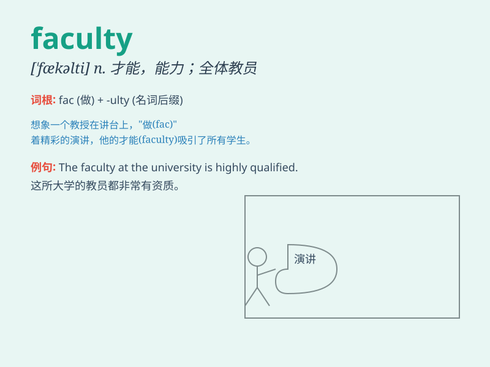

## faculty

**英音:** _[\'fæk(ə)ltɪ]_ **美音:** _[ˈfækəlti]_

**译义:** *n.才能,本领,能力,全体教员,(大学的)系,科,(授予的)权力*

### 短语

+ **faculty member:** _教职员_

+ **faculty of law:** _法学院_

+ **mental faculty:** _智力；心理能力_

+ **faculty lounge:** _教员休息室_

+ **academic faculty:** _学术人员；学术师资_

### 例句

#### 例句1

> **The faculty of this university is highly qualified.**

**中文翻译:** 这所大学的教师队伍素质很高。

**单词释义:** 全体教员

#### 例句2

> **He has a great faculty for learning languages.**

**中文翻译:** 他拥有出色的语言学习能力。

**单词释义:** 能力；才能

#### 例句3

> **The faculty of sight is very important for us.**

**中文翻译:** 视觉能力对我们来说非常重要。

**单词释义:** 官能；天赋

### 背诵小故事

> A group of students were lost in a forest. Luckily, a wise old man
with the faculty of navigation led them out. The faculty here means an
ability or power.

**一群学生在森林里迷路了。幸运的是，一位有着导航能力的睿智老人带他们走了出来。这里的faculty指的是能力或才能。**

### 图义

