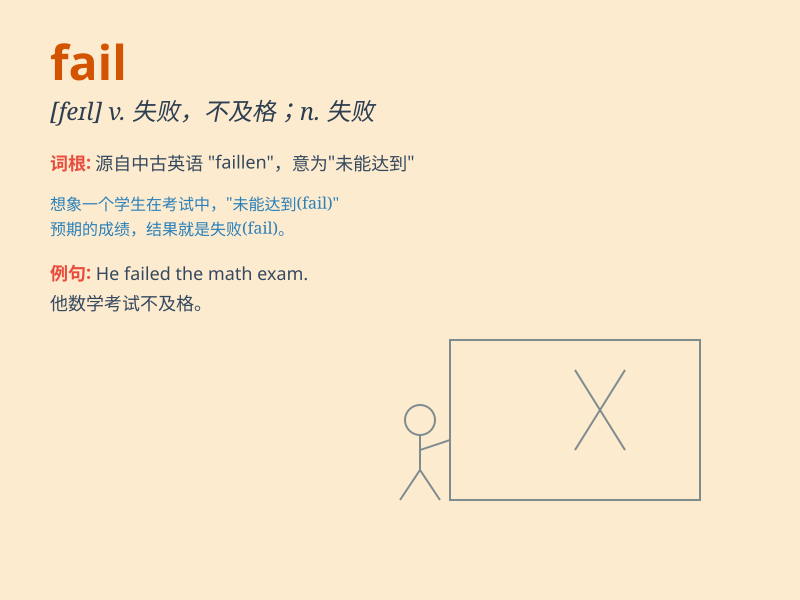

## fail

**英音:** _[feɪl]_ **美音:** _[fel]_

**译义:**
*vi.失败,不及格,忘记vt.使失望,舍弃,辜负,不及格n.不及格,不及格者*

### 短语

+ **fail in:** _在\...\...方面失败_

+ **fail to do sth:** _未能做某事_

+ **without fail:** _必定；务必_

+ **fail an exam:** _考试不及格_

+ **fail of:** _缺乏；不足_

### 例句

#### 例句1

> **I failed the exam again.**

**中文翻译:** 我考试又失败了。

**单词释义:** 不及格；未通过

#### 例句2

> **The engine failed on the way.**

**中文翻译:** 途中发动机发生故障。

**单词释义:** 出故障；失灵

#### 例句3

> **He failed to keep his promise.**

**中文翻译:** 他没有遵守诺言。

**单词释义:** 未能；未做到

### 背诵小故事

> Once there was a student who always studied carelessly. When it came
to the exam, he didn\'t review well and failed. This made him realize
that not working hard would lead to fail.

**曾经有个学生总是学习很粗心。考试的时候，他没有好好复习，结果不及格。这让他明白不努力就会失败。**

### 图义

