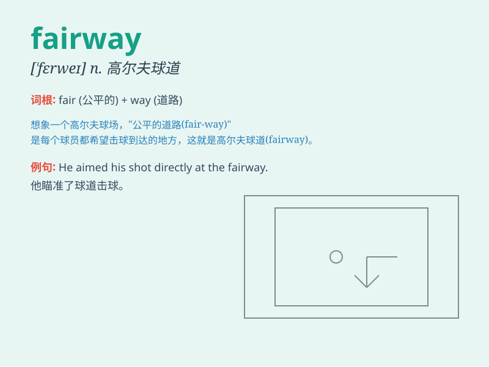

## fairway

**英音:** _[\'feəweɪ]_ **美音:** _[\'fɛrwe]_

**译义:** *n.航路,[空]水上飞机升降用的水面跑道*

### 短语

+ **fairway wood:** _球道木杆（高尔夫球运动中的一种球杆）_

+ **fairway bunkers:** _球道沙坑_

+ **hit the fairway:** _击球落在球道上_

+ **stay on the fairway:** _保持在球道上_

+ **fairway shot:** _球道击球_

### 例句

#### 例句1

> **The golfer hit the ball down the fairway.**

**中文翻译:** 高尔夫球手将球击到球道上。

**单词释义:** 球道

#### 例句2

> **The ship followed the fairway into the harbor.**

**中文翻译:** 船沿着航道驶入港口。

**单词释义:** 航道

#### 例句3

> **The fairway was lined with beautiful trees.**

**中文翻译:** 球道两旁种满了美丽的树木。

**单词释义:** 球道

### 背诵小故事

> A golfer was lost on the course. But when he found the fairway, he
was so happy. The fairway was wide and smooth, leading him straight to
the hole. It was a path of hope and success.

**一位高尔夫球手在球场上迷路了。但当他找到球道时，他非常高兴。球道又宽又平坦，直接通向球洞。这是一条充满希望和成功的道路。**

### 图义

