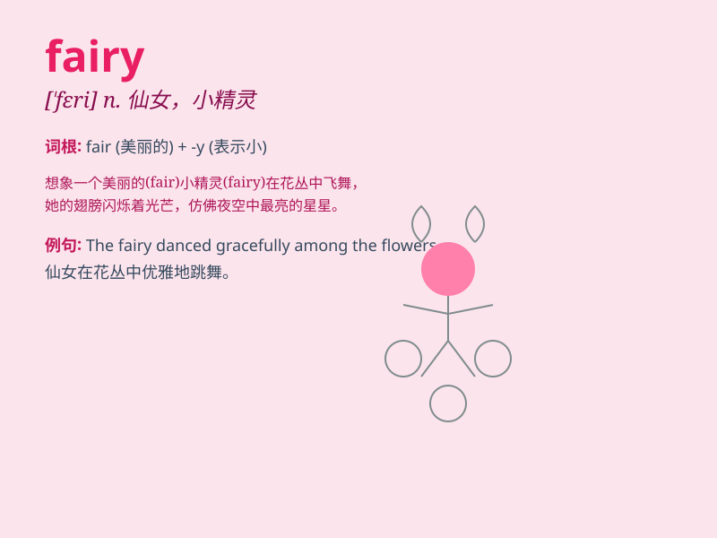

## fairy

**英音:** _[\'feərɪ]_ **美音:** _[\'fɛri]_

**译义:** *n.仙女,精灵,\<美俚>漂亮姑娘adj.仙女的*

### 短语

+ **fairy tale:** _童话故事_

+ **fairy godmother:** _仙女教母_

+ **tooth fairy:** _牙仙_

+ **fairy lights:** _彩灯；仙女灯_

+ **fairyland:** _仙境；仙界_

### 例句

#### 例句1

> **The little girl believes in fairies.**

**中文翻译:** 小女孩相信仙女。

**单词释义:** 仙女

#### 例句2

> **The garden was like a fairyland.**

**中文翻译:** 花园就像一个仙境。

**单词释义:** 仙境

#### 例句3

> **She wore a fairy costume to the party.**

**中文翻译:** 她穿着仙女服装参加聚会。

**单词释义:** 仙女的

### 背诵小故事

> Once upon a time, in a magical forest, a little girl met a fairy with
shiny wings. The fairy granted her a wish and brought joy. Remember, a
fairy is like a magical being that brings wonders.

**从前，在一个神奇的森林里，一个小女孩遇到了一个有着闪亮翅膀的仙女。仙女满足了她的一个愿望并带来了欢乐。记住，fairy（仙女）就像是带来奇迹的神奇存在。**

### 图义

