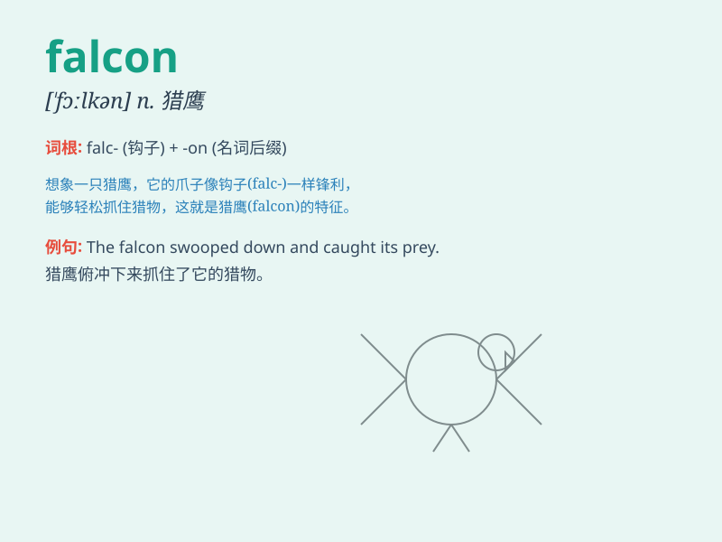

## falcon

**英音:** _[\'fɔː(l)k(ə)n; \'fɒlk(ə)n]_ **美音:**
_[\'fælkən]_

**译义:** *n.[动](猎鸟用的)猎鹰*

### 短语

+ **peregrine falcon:** _游隼_

+ **falconiformes:** _隼形目_

+ **gyrfalcon:** _矛隼_

+ **falcon punch:** _猎鹰拳（一种拳击动作）_

+ **saker falcon:** _猎隼_

### 例句

#### 例句1

> **The falcon soared high in the sky, hunting for its prey.**

**中文翻译:** 猎鹰在高空翱翔，寻找猎物。

**单词释义:** 猎鹰

#### 例句2

> **The trained falcon returned to its handler\'s arm.**

**中文翻译:** 训练有素的猎鹰回到了它的训练者的手臂上。

**单词释义:** 猎鹰

#### 例句3

> **We watched as the falcon dived sharply towards the ground.**

**中文翻译:** 我们看到猎鹰猛烈地向地面俯冲。

**单词释义:** 猎鹰

### 背诵小故事

> One day, a brave knight was lost in the forest. Suddenly, a falcon
appeared and guided him out. The falcon\'s sharp eyes and swift flight
left a deep impression. The knight was grateful for the falcon\'s help.

**有一天，一位勇敢的骑士在森林里迷路了。突然，一只猎鹰出现并引导他走了出去。猎鹰敏锐的眼睛和敏捷的飞行给他留下了深刻的印象。骑士很感激猎鹰的帮助。**

### 图义

