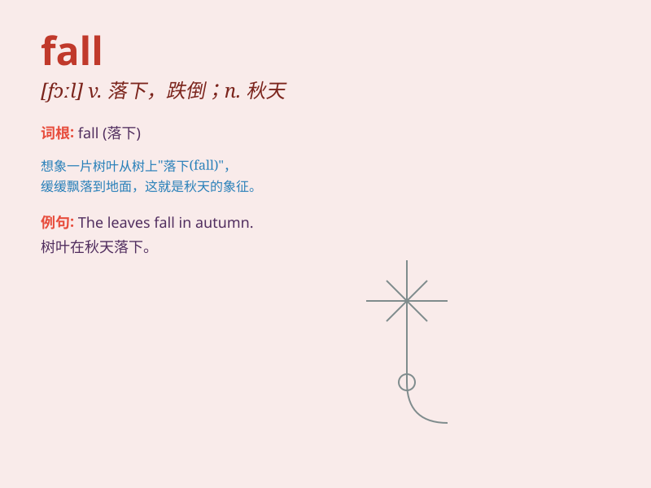

## fall

**英音:** _[fɔːl]_ **美音:** _[fɔl]_

**译义:**
*n.秋天,落下,瀑布,降低,落差,采伐量,堕落,下降vi.倒下,落下,来临,失守,变成,垮台,下跌,阵亡vt.\<美>\<英方>击倒,砍倒(树木)adj.秋天的*

### 短语

+ **fall asleep:** _入睡；睡着_

+ **fall behind:** _落后；掉队_

+ **fall in love:** _坠入爱河；相爱_

+ **fall down:** _跌倒；倒塌_

+ **fall off:** _减少；跌落；下降_

### 例句

#### 例句1

> **The leaves fall from the trees in autumn.**

**中文翻译:** 秋天树叶从树上掉下来。

**单词释义:** 掉落

#### 例句2

> **She had a bad fall and broke her leg.**

**中文翻译:** 她摔得很重，摔断了腿。

**单词释义:** 摔倒

#### 例句3

> **The temperature will fall below zero tonight.**

**中文翻译:** 今晚气温将降至零以下。

**单词释义:** 下降

### 背诵小故事

> One day, a little monkey was playing on a tree branch. Suddenly, it
lost its balance and fell to the ground. But it was okay and learned to
be more careful. The word \'fall\' means to drop or go down.

**有一天，一只小猴子正在树枝上玩耍。突然，它失去平衡摔到了地上。但它没事，也学会了更小心。单词\'fall\'意思是掉落或下降。**

### 图义

