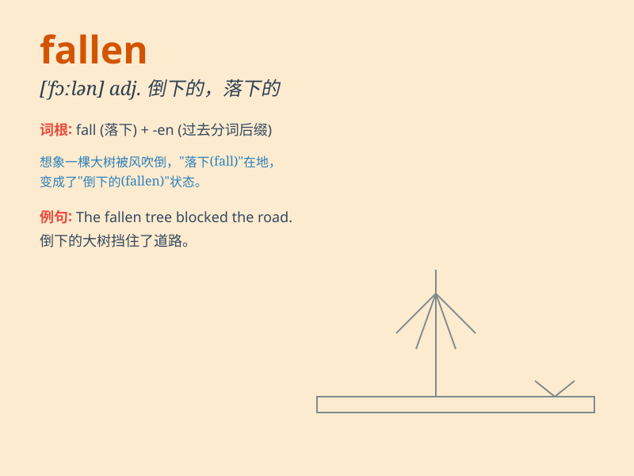

## fallen

**英音:** _[\'fɔːl(ə)n]_ **美音:** _[\'fɔlən]_

**译义:** *adj.倒下的,伐倒的,伏地的,堕落的,落下来的,陷落的 vbl.fall
的过去分词*

### 短语

+ **fallen angel:** _堕落天使_

+ **fallen leaves:** _落叶_

+ **fallen tree:** _倒下的树_

+ **fallen woman:** _堕落的女人；失身的女人_

+ **fallen soldier:** _阵亡的士兵_

### 例句

#### 例句1

> **The fallen leaves covered the ground in autumn.**

**中文翻译:** 秋天，落叶覆盖了地面。

**单词释义:** 落下的

#### 例句2

> **He helped the fallen old man stand up.**

**中文翻译:** 他扶着摔倒的老人站了起来。

**单词释义:** 倒下的；摔倒的

#### 例句3

> **The fallen angel was banished from heaven.**

**中文翻译:** 堕落天使被逐出了天堂。

**单词释义:** 堕落的

### 背诵小故事

> A brave knight was fighting a fierce dragon. But unfortunately, he
was knocked down and fallen from his horse. However, with his strong
will, he stood up and finally defeated the dragon.

**一位勇敢的骑士正在与一条凶猛的龙战斗。但不幸的是，他被击倒并从马上摔了下来。然而，凭借着坚强的意志，他站了起来并最终打败了龙。**

### 图义

