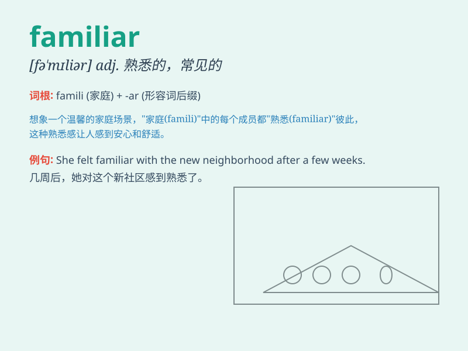

## familiar

**英音:** _[fə\'mɪlɪə]_ **美音:** _[fə\'mɪljɚ]_

**译义:** *adj.熟悉的,常见的,听惯的,亲近的,随便的n.密友,熟客,常客*

### 短语

+ **be familiar with:** _熟悉；通晓；精通_

+ **familiar face:** _熟悉的面孔_

+ **familiar scene:** _熟悉的场景_

+ **familiar smell:** _熟悉的气味_

+ **familiar sound:** _熟悉的声音_

### 例句

#### 例句1

> **I\'m familiar with this city.**

**中文翻译:** 我对这座城市很熟悉。

**单词释义:** 熟悉

#### 例句2

> **The smell is familiar to me.**

**中文翻译:** 这味道我很熟悉。

**单词释义:** 熟悉的

#### 例句3

> **She has a familiar face.**

**中文翻译:** 她有一张熟悉的面孔。

**单词释义:** 熟悉的

### 背诵小故事

> Once upon a time, there was a cat. It was familiar with every corner
of the house. It knew where the food was and where to sleep comfortably.
So, \'familiar\' means well-known and recognized.

**从前，有一只猫。它对房子的每个角落都很熟悉。它知道食物在哪里，也知道在哪里能舒服地睡觉。所以，'familiar'意思是熟悉的，熟知的。**

### 图义

