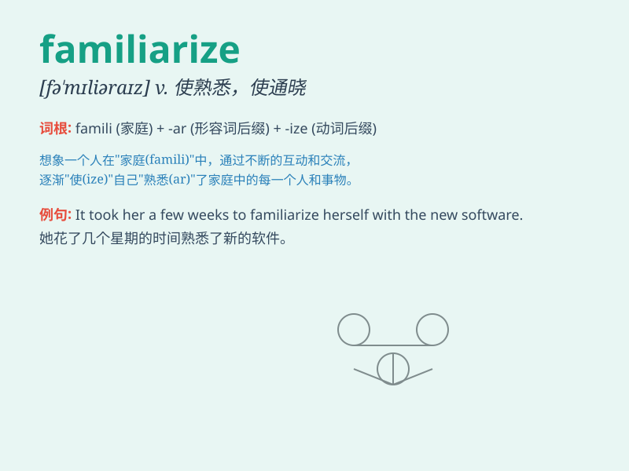

## familiarize

**英音:** _[fə\'mɪlɪəraɪz]_ **美音:** _[fə\'mɪlɪəraɪz]_

**译义:** *v.熟悉*

### 短语

+ **familiarize oneself with:** _使自己熟悉_

+ **familiarize sb/sth with sth:** _使某人/某物熟悉某物_

+ **become familiarized with:** _变得熟悉_

+ **be familiarized to:** _为\...\...所熟悉_

+ **familiarize thoroughly:** _彻底熟悉_

### 例句

#### 例句1

> **You should familiarize yourself with the new software before
using it.**

**中文翻译:** 在使用新软件之前，您应该熟悉它。

**单词释义:** 使熟悉

#### 例句2

> **It\'s necessary to familiarize the students with the safety
rules.**

**中文翻译:** 有必要让学生熟悉安全规则。

**单词释义:** 使熟悉

#### 例句3

> **The tour guide is trying to familiarize the tourists with the
local customs.**

**中文翻译:** 导游正在努力让游客熟悉当地的风俗习惯。

**单词释义:** 使熟悉

### 背诵小故事

> A new student came to the school. The teacher wanted to familiarize
him with the campus. So, they walked around and saw classrooms,
libraries, and playgrounds. Soon, the student felt at home.

**一个新学生来到学校。老师想让他熟悉校园。所以，他们四处走走，看到了教室、图书馆和操场。很快，这个学生就感觉自在了。**

### 图义

