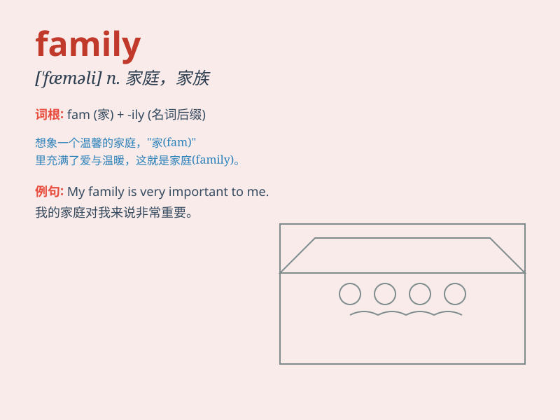

## family

**英音:** _[ˈfæməlɪ]_ **美音:** _[ˈfæməlɪ]_

**译义:** *n.家庭,家族,家属,亲属,子女,僚属adj.家庭的,家族的*

### 短语

+ **family member:** _家庭成员_

+ **family tree:** _家谱；家族树_

+ **extended family:** _大家庭；扩展家庭_

+ **family planning:** _计划生育_

+ **family name:** _姓氏_

### 例句

#### 例句1

> **My family is very big. We have five people.**

**中文翻译:** 我的家庭很大。我们有五个人。

**单词释义:** 家庭

#### 例句2

> **All my family members get together on weekends.**

**中文翻译:** 我所有的家人周末都会聚在一起。

**单词释义:** 家庭成员

#### 例句3

> **He has a close family.**

**中文翻译:** 他有一个亲密的家庭。

**单词释义:** 家庭

### 背诵小故事

> A father, a mother, and their lovely children live together. They
share happiness and sadness. This group of people is called a family.
They love and care for each other always.

**一位父亲、一位母亲和他们可爱的孩子们生活在一起。他们分享快乐和悲伤。这群人被称为家庭。他们永远彼此关爱。**

### 图义

