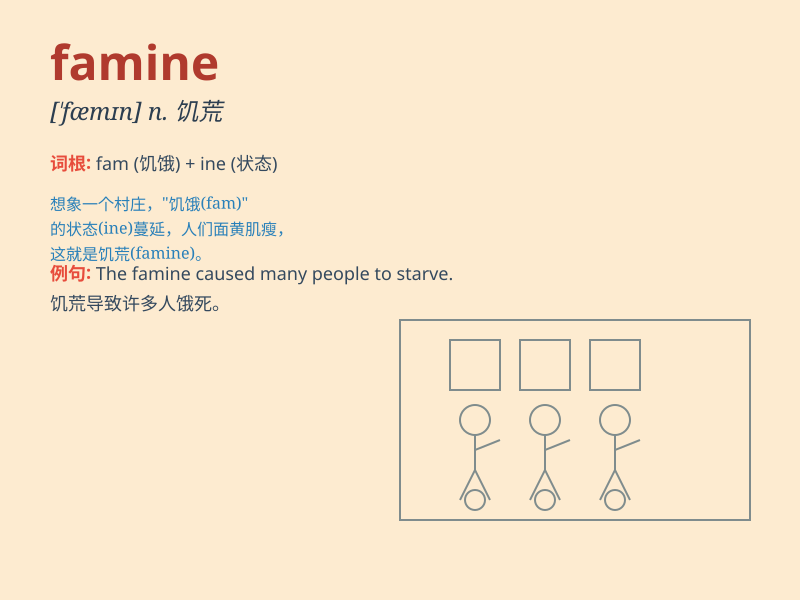

## famine

**英音:** _[\'fæmɪn]_ **美音:** _[\'fæmɪn]_

**译义:** *n.饥荒,\<古>饥饿,严重的缺乏*

### 短语

+ **famine relief:** _饥荒救济_

+ **famine area:** _饥荒地区_

+ **famine victim:** _饥荒灾民_

+ **famine year:** _饥荒年_

+ **famine prevention:** _饥荒预防_

### 例句

#### 例句1

> **The famine has caused widespread hunger and poverty.**

**中文翻译:** 饥荒造成了普遍的饥饿和贫困。

**单词释义:** 饥荒

#### 例句2

> **The region is prone to famine due to its arid climate.**

**中文翻译:** 由于气候干旱，该地区很容易发生饥荒。

**单词释义:** 饥荒

#### 例句3

> **People suffered greatly during the famine years.**

**中文翻译:** 饥荒年代，人民遭受极大苦难。

**单词释义:** 饥荒

### 背诵小故事

> In a distant land, crops failed for years. People had no food, and
chaos spread. This horrible situation was called \'famine\'. It was a
time of great hunger and suffering.

**在一片遥远的土地上，庄稼连年歉收。人们没有食物，混乱蔓延。这种可怕的情况被称为"饥荒"。那是一段极度饥饿和痛苦的时期。**

### 图义

