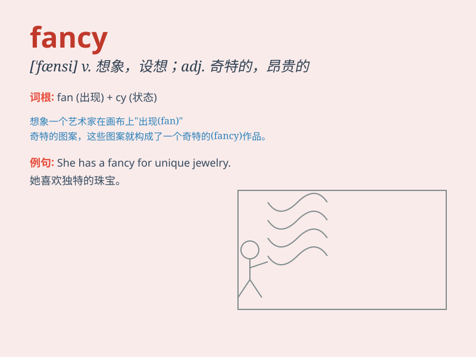

## fancy

**英音:** _[\'fænsɪ]_ **美音:** _[\'fænsi]_

**译义:**
*adj.奇特的,异样的vt.想象,设想,认为,爱好,自负n.爱好,迷恋,想象力*

### 短语

+ **take a fancy to:** _喜欢上；爱上_

+ **fancy dress:** _化装舞会服装；奇装异服_

+ **fancy oneself:** _自命不凡；自负_

+ **catch someone\'s fancy:** _吸引某人；中某人的意_

+ **fancy meeting you here:** _真想不到在这儿遇见你_

### 例句

#### 例句1

> **I don\'t fancy going for a walk in the rain.**

**中文翻译:** 我不想在雨中散步。

**单词释义:** 想要；喜欢

#### 例句2

> **She has a fancy for chocolate cakes.**

**中文翻译:** 她很喜欢巧克力蛋糕。

**单词释义:** 喜爱；爱好

#### 例句3

> **The dress was too fancy for the occasion.**

**中文翻译:** 这件衣服对于这个场合来说太花哨了。

**单词释义:** 花哨的；别致的

### 背诵小故事

> One day, I saw a very fancy dress in a shop. It had beautiful colors
and patterns. I immediately fancied it and decided to buy it for a
special occasion. It made me feel like a princess.

**有一天，我在一家商店看到了一件非常别致的连衣裙。它有着美丽的颜色和图案。我立刻喜欢上了它，并决定为一个特殊场合买下它。它让我感觉自己像个公主。**

### 图义

