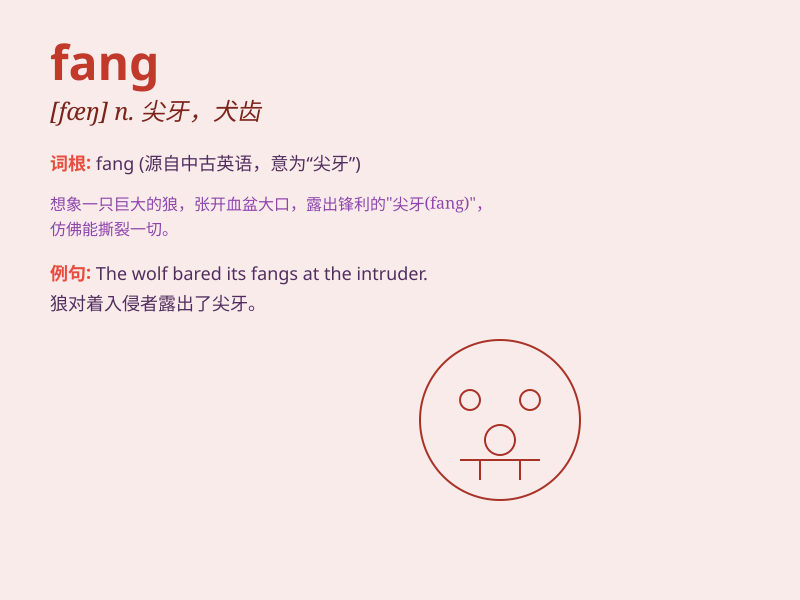

## fang

**英音:** _[fæŋ]_ **美音:** _[fæŋ]_

**译义:**
*n.(犬,狼等的)尖牙,犬牙,(毒蛇的)毒牙,牙根,尖端vt.灌水引动(水泵)*

### 短语

+ **fang tooth:** _尖牙_

+ **poison fang:** _毒牙_

+ **snake fang:** _蛇牙_

+ **dragon fang:** _龙牙_

+ **fang mark:** _牙痕_

### 例句

#### 例句1

> **The snake bared its fangs.**

**中文翻译:** 蛇露出了獠牙。

**单词释义:** 毒牙；尖牙

#### 例句2

> **The dog showed its fangs when it was angry.**

**中文翻译:** 狗生气时会露出獠牙。

**单词释义:** 獠牙

#### 例句3

> **The wolf\'s fangs were sharp and menacing.**

**中文翻译:** 狼的獠牙锋利而凶恶。

**单词释义:** 尖牙

### 背诵小故事

> A brave adventurer was lost in a dark forest. Suddenly, a venomous
snake appeared from a fang-shaped cave. The adventurer was scared but
managed to escape. Remember, \'fang\' means a sharp tooth of an animal.

**一位勇敢的冒险家在黑暗的森林中迷路了。突然，一条毒蛇从一个獠牙形状的洞穴中出现。冒险家很害怕，但设法逃脱了。记住，'fang'意思是动物的尖牙。**

### 图义

