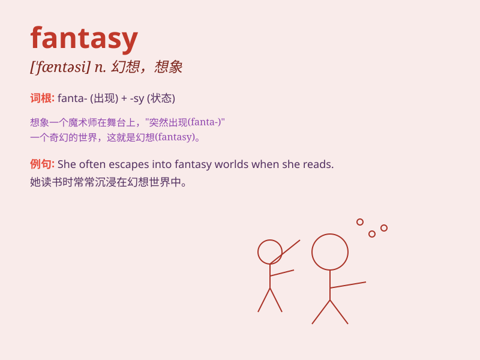

## fantasy

**英音:** _[\'fæntəsɪ; -zɪ]_ **美音:** _[\'fæntəsi]_

**译义:** *n.幻想,白日梦*

### 短语

+ **fantasy world:** _幻想世界_

+ **sexual fantasy:** _性幻想_

+ **live in a fantasy:** _生活在幻想中_

+ **fantasy novel:** _奇幻小说_

+ **fantasy football:** _梦幻足球（一种虚拟的足球游戏）_

### 例句

#### 例句1

> **She indulged in fantasies of becoming a famous singer.**

**中文翻译:** 她沉迷于成为一名著名歌手的幻想。

**单词释义:** 幻想；想象

#### 例句2

> **The book is a fantasy novel set in a magical world.**

**中文翻译:** 这本书是一部以魔法世界为背景的奇幻小说。

**单词释义:** 奇幻；幻想作品

#### 例句3

> **His story was pure fantasy and had no basis in reality.**

**中文翻译:** 他的故事纯粹是幻想，没有现实依据。

**单词释义:** 幻想；空想

### 背诵小故事

> A young artist always had a fantasy of creating a magical world in
his paintings. One day, his dream came true. In this world, everything
was so wonderful and beyond imagination.

**一位年轻的艺术家总是幻想在他的画作中创造一个神奇的世界。有一天，他的梦想成真了。在这个世界里，一切都如此美妙，超乎想象。**

### 图义

