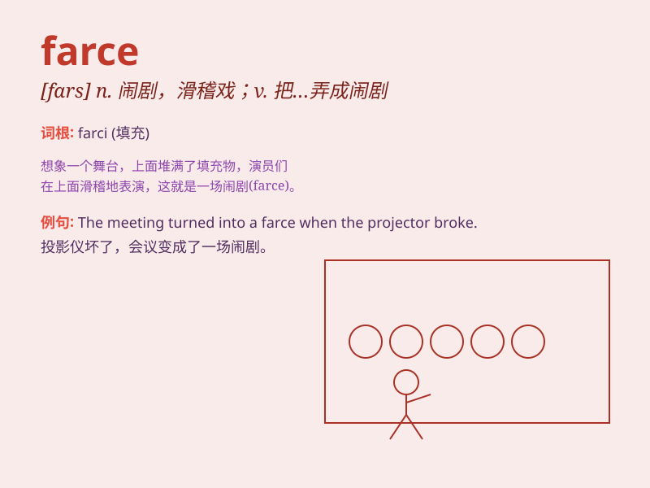

## farce

**英音:** _[fɑːs]_ **美音:** _[fɑrs]_

**译义:**
*n.笑剧,闹剧,滑稽剧,胡闹vt.\<古>填塞,为(演讲,作品等)加穿插*

### 短语

+ **a political farce:** _一场政治闹剧_

+ **turn into a farce:** _变成一场闹剧_

+ **comic farce:** _喜剧闹剧_

+ **stage farce:** _舞台闹剧_

+ **a farce of justice:** _一场司法闹剧_

### 例句

#### 例句1

> **The play turned out to be a farce.**

**中文翻译:** 结果这出戏变成了一场闹剧。

**单词释义:** 闹剧；滑稽戏

#### 例句2

> **The trial was a complete farce.**

**中文翻译:** 审判完全是一场闹剧。

**单词释义:** 荒唐的事；闹剧

#### 例句3

> **His performance was a farce that made everyone laugh.**

**中文翻译:** 他的表演是一场闹剧，逗得大家哈哈大笑。

**单词释义:** 滑稽戏；可笑的行为

### 背诵小故事

> A funny man was performing in a theater. His act was full of crazy
and absurd scenes, like people running around in strange clothes. It was
a total farce! Everyone laughed loudly.

**一个有趣的人在剧院表演。他的表演充满了疯狂和荒诞的场景，比如人们穿着奇怪的衣服到处跑。这完全是一场闹剧！每个人都大笑起来。**

### 图义

