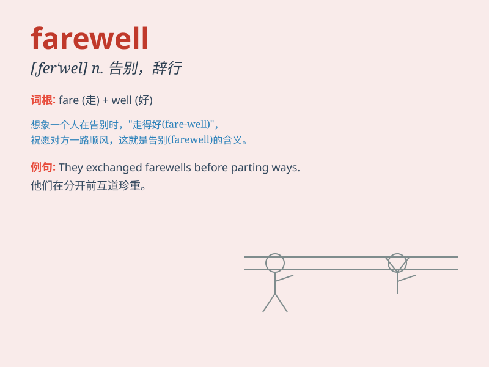

## farewell

**英音:** _[feə\'wel]_ **美音:** _[,fɛr\'wɛl]_

**译义:**
*n.辞别,再见,再会int.再会,别了!(常含有永别或不容易再见面的意思)*

### 短语

+ **bid farewell:** _告别；道别_

+ **farewell party:** _告别派对_

+ **farewell speech:** _告别演说_

+ **farewell dinner:** _告别晚宴_

+ **farewell gift:** _告别礼物_

### 例句

#### 例句1

> **They bade him farewell as he set off on his journey.**

**中文翻译:** 当他踏上旅程时，他们向他告别。

**单词释义:** 告别

#### 例句2

> **The farewell party was a touching event.**

**中文翻译:** 告别晚会是一次感人至深的活动。

**单词释义:** 告别

#### 例句3

> **She said her farewells and left the room.**

**中文翻译:** 她道别后离开了房间。

**单词释义:** 告别

### 背诵小故事

> A group of friends were at the port to say farewell to one who was
leaving on a long journey. They hugged, tears in their eyes, knowing it
would be a while before they met again. \'Farewell\' was the word filled
with sadness and hope.

**一群朋友在港口向即将踏上长途旅行的人告别。他们拥抱，眼中含泪，知道再次相见还需时日。'farewell'这个词充满了悲伤和希望。**

### 图义

