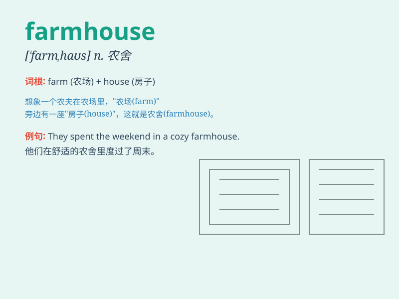

## farmhouse

**英音:** _[\'fɑːmhaʊs]_ **美音:** _[\'fɑrm\'haʊs]_

**译义:** *n.农场里的住房,农舍,农家*

### 短语

+ **old farmhouse:** _旧农舍_

+ **country farmhouse:** _乡村农舍_

+ **traditional farmhouse:** _传统农舍_

+ **large farmhouse:** _大型农舍_

+ **small farmhouse:** _小型农舍_

### 例句

#### 例句1

> **The farmhouse is surrounded by beautiful gardens.**

**中文翻译:** 农舍周围环绕着美丽的花园。

**单词释义:** 农舍

#### 例句2

> **We spent the weekend in a charming farmhouse in the
countryside.**

**中文翻译:** 我们在乡村一座迷人的农舍里度过了周末。

**单词释义:** 农舍

#### 例句3

> **The old farmhouse has been renovated and turned into a
guesthouse.**

**中文翻译:** 老农舍经过改造，变成了宾馆。

**单词释义:** 农舍

### 背诵小故事

> One day, a little boy got lost and ended up at a farmhouse. The
farmhouse was surrounded by beautiful fields. There was a kind farmer
who welcomed him and gave him food. The boy always remembered this warm
farmhouse.

**有一天，一个小男孩迷路了，最后来到了一个农舍。农舍被美丽的田野环绕着。有一位善良的农夫欢迎他，并给他食物。这个男孩永远记住了这个温暖的农舍。**

### 图义

