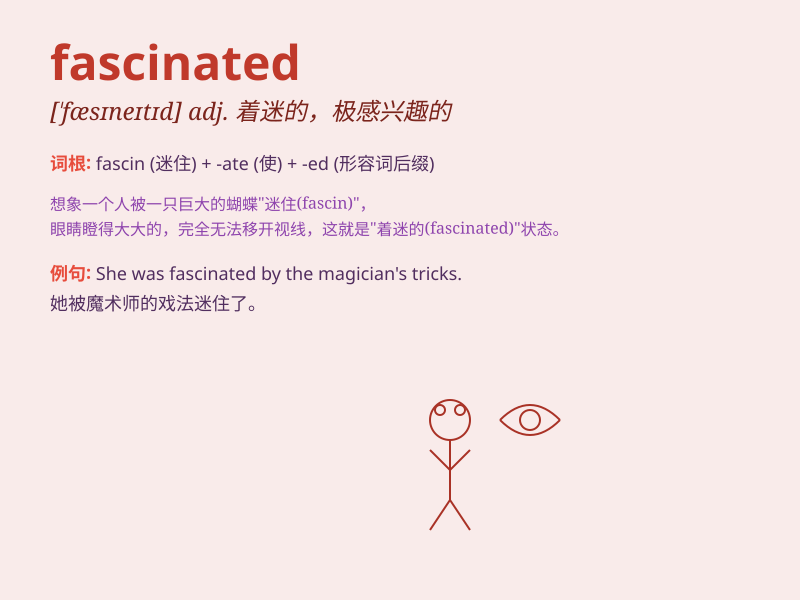

## fascinated

**英音:** _[ˈfæsɪneɪtɪd]_ **美音:** _[ˈfæsɪˌneɪtɪd]_

**译义:** *adj.着迷的,入神的,极感兴趣的*

### 短语

+ **be fascinated by:** _被\...\...迷住；为\...\...所吸引_

+ **fascinated audience:** _着迷的观众_

+ **remain fascinated:** _保持着迷_

+ **become fascinated:** _变得着迷_

+ **fascinated gaze:** _着迷的凝视_

### 例句

#### 例句1

> **I was fascinated by the beautiful scenery.**

**中文翻译:** 我被那美丽的风景迷住了。

**单词释义:** 着迷；被深深吸引

#### 例句2

> **She has always been fascinated with history.**

**中文翻译:** 她一直对历史很着迷。

**单词释义:** 着迷；被吸引

#### 例句3

> **The children were fascinated by the magic show.**

**中文翻译:** 孩子们被魔术表演吸引住了。

**单词释义:** 被吸引；入迷

### 背诵小故事

> One day, I went to a magic show. The magician\'s wonderful tricks
fascinated me completely. I couldn\'t take my eyes off the stage. His
performance was so charming and made me feel like in a dreamy world.

**有一天，我去看了一场魔术表演。魔术师精彩的戏法完全把我迷住了。我的眼睛一刻也无法从舞台上移开。他的表演太迷人了，让我仿佛置身于梦幻世界。**

### 图义

