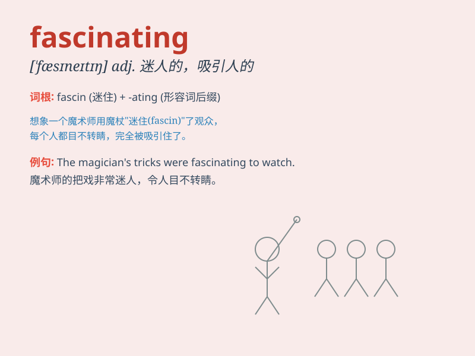

## fascinating

**英音:** _[\'fæsɪneɪtɪŋ]_ **美音:** _[\'fæsɪnetɪŋ]_

**译义:** *adj.迷人的,醉人的,着魔的*

### 短语

+ **fascinating story:** _迷人的故事_

+ **fascinating scenery:** _迷人的风景_

+ **fascinating personality:** _迷人的个性_

+ **fascinating history:** _迷人的历史_

+ **fascinating culture:** _迷人的文化_

### 例句

#### 例句1

> **The history of ancient Egypt is fascinating.**

**中文翻译:** 古埃及的历史非常精彩。

**单词释义:** 令人着迷的

#### 例句2

> **She has a fascinating smile.**

**中文翻译:** 她有着迷人的微笑。

**单词释义:** 迷人的

#### 例句3

> **The book presents a fascinating account of her travels.**

**中文翻译:** 这本书对她的旅行进行了精彩的描述。

**单词释义:** 生动的；吸引人的

### 背诵小故事

> One day, I went to a magic show. The magician\'s tricks were
fascinating. Everyone was completely drawn in by his amazing
performance. It was so wonderful that I couldn\'t take my eyes off the
stage.

**有一天，我去看了一场魔术表演。魔术师的戏法令人着迷。每个人都完全被他精彩的表演吸引住了。太精彩了，我眼睛都无法从舞台上移开。**

### 图义

