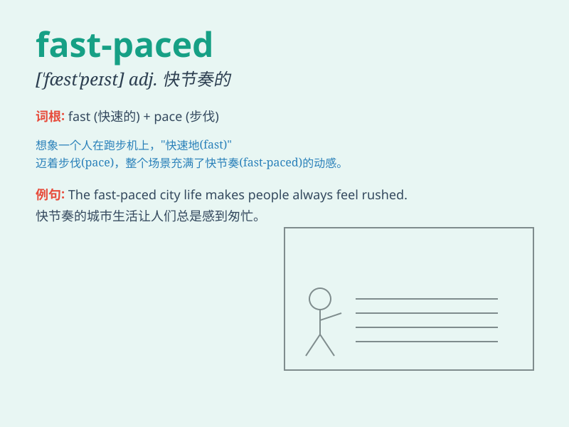

## fast-paced

**英音:** _[ˌfɑːst ˈpeɪst]_ **美音:** _[ˌfæst ˈpeɪst]_

**译义:** *adj.快节奏的；快速的*

### 短语

+ **fast-paced life:** _快节奏的生活_

+ **fast-paced society:** _快节奏的社会_

+ **fast-paced work:** _快节奏的工作_

+ **fast-paced environment:** _快节奏的环境_

+ **fast-paced city:** _快节奏的城市_

### 例句

#### 例句1

> **The city life is fast-paced and exciting.**

**中文翻译:** 城市生活节奏快且令人兴奋。

**单词释义:** 节奏快的

#### 例句2

> **In a fast-paced workplace, you need to be highly efficient.**

**中文翻译:** 在快节奏的工作场所，你需要高效。

**单词释义:** 快节奏的

#### 例句3

> **Modern society is becoming increasingly fast-paced.**

**中文翻译:** 现代社会正变得越来越快节奏。

**单词释义:** 快节奏的

### 背诵小故事

> A young man named Tom was always in a rush. He lived in a fast-paced
city, running from one meeting to another. His life was like a speeding
train, never stopping. \'Fast-paced\' describes this kind of busy and
rapid lifestyle.

**一个叫汤姆的年轻人总是很匆忙。他生活在一个快节奏的城市里，从一个会议赶到另一个会议。他的生活就像一列飞驰的火车，从未停歇。'fast-paced'形容的就是这种忙碌快速的生活方式。**

### 图义

