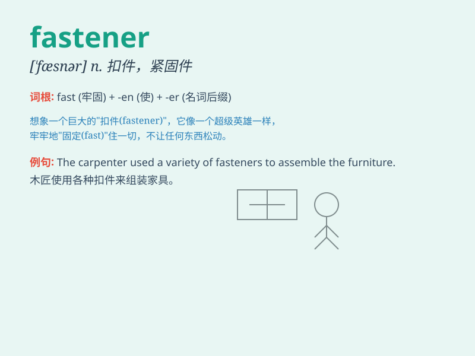

## fastener

**英音:** _[\'fɑːsənə]_ **美音:** _[\'fæsnɚ]_

**译义:** *n.扣件,纽扣,按钮,使系牢之物*

### 短语

+ **metal fastener:** _金属扣件_

+ **plastic fastener:** _塑料扣件_

+ **safety fastener:** _安全扣件_

+ **quick-release fastener:** _快速释放扣件_

+ **heavy-duty fastener:** _重型扣件_

### 例句

#### 例句1

> **The fastener on my bag broke.**

**中文翻译:** 我包上的扣件坏了。

**单词释义:** 扣件；紧固件

#### 例句2

> **He used a special fastener to secure the shelf to the wall.**

**中文翻译:** 他使用特殊的紧固件将架子固定在墙上。

**单词释义:** 紧固件

#### 例句3

> **The fastener of this dress is too tight.**

**中文翻译:** 这件衣服的扣子太紧了。

**单词释义:** 扣子；扣合件

### 背诵小故事

> A little monkey was playing in the forest. Suddenly, its hat flew
off. Luckily, it found a fastener to fix the hat. The fastener was like
a magic helper, keeping the hat in place.

**一只小猴子在森林里玩耍。突然，它的帽子飞掉了。幸运的是，它找到了一个扣件来固定帽子。这个扣件就像一个神奇的帮手，让帽子固定住了。**

### 图义

